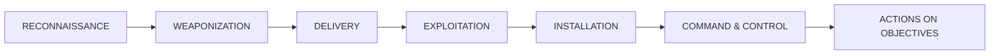
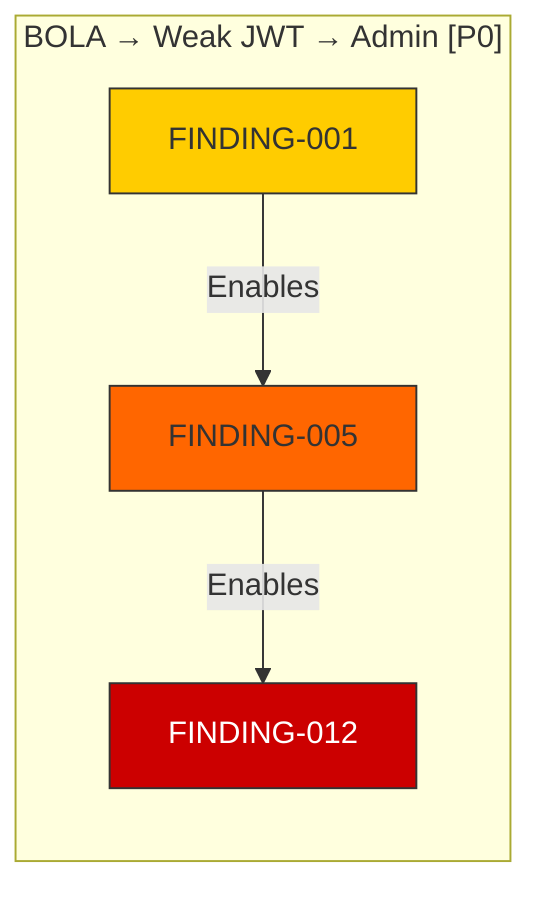

# Attack Chain Analysis

Correlate individual findings into complete attack narratives.

## When to Use
- Multiple findings discovered across different agents/phases
- Need to correlate findings into complete attack narratives
- Prioritizing exploitation targets for maximum impact
- Building exploitation roadmaps with HITL approval
- Mapping attack paths to MITRE ATT&CK and D3FEND

## Core Capabilities

### Kill Chain Mapping

Map findings to the Cyber Kill Chain:



| Phase | MITRE Tactics | Typical Findings |
|-------|--------------|------------------|
| Reconnaissance | TA0043 | OSINT, DNS, subdomain enum |
| Weaponization | TA0001 | Payload crafting, exploit dev |
| Delivery | TA0001 | Phishing, drive-by, supply chain |
| Exploitation | TA0002, TA0003 | RCE, SQLi, XSS, auth bypass |
| Installation | TA0003, TA0005 | Persistence, backdoors |
| C2 | TA0011 | Beacons, tunnels, domain fronting |
| Objectives | TA0007, TA0009, TA0010 | Data theft, destruction, impact |

## Chain Building Process

### Step 1: Finding Inventory

Collect all individual findings with their scores:

```yaml
findings:
  - id: F1
    type: INFORMATION_DISCLOSURE
    confidence: 9
    severity: 3
    target: api.example.com
  - id: F2
    type: SSRF
    confidence: 7
    severity: 6
    target: api.example.com
  - id: F3
    type: AWS_METADATA_ACCESS
    confidence: 6
    severity: 8
    target: 169.254.169.254
  - id: F4
    type: IAM_CREDENTIAL_EXTRACTION
    confidence: 5
    severity: 9
    target: AWS Account
```

### Step 2: Connection Analysis

Identify how findings connect:

```yaml
connections:
  - from: F1
    to: F2
    relationship: "reveals internal endpoints"
  - from: F2
    to: F3
    relationship: "enables metadata access"
  - from: F3
    to: F4
    relationship: "enables credential extraction"
```

### Step 3: Chain Scoring

For the complete chain:

| Metric | Formula | Example |
|--------|---------|---------|
| **Chain Confidence** | `min(individual_confidences)` | `min(9, 7, 6, 5) = 5/10` |
| **Chain Severity** | `max(individual_severities)` | `max(3, 6, 8, 9) = 9/10` |
| **Chain Complexity** | `count(steps)` | `4 steps = Medium` |

### Step 4: Narrative Construction

```markdown
## Attack Chain: Info Disclosure → Cloud Compromise

**Chain Confidence:** 5/10 | **Chain Severity:** 9/10
**Steps:** 4 | **Complexity:** Medium

### Narrative
An attacker could leverage the information disclosure in the
error messages (F1) to discover internal service endpoints.
Using this knowledge, they could exploit the SSRF vulnerability
(F2) to access the cloud metadata service (F3), extracting
temporary IAM credentials (F4) that grant administrative
access to the AWS account.

### Impact
Complete compromise of the cloud infrastructure, including
access to all S3 buckets, databases, and the ability to
launch new resources.
```

## 8 Standard Attack Chain Templates

| Template | Pattern | MITRE Path | D3FEND Counters | Priority |
|----------|---------|------------|-----------------|----------|
| BOLA → JWT → Admin | IDOR + Weak JWT + Auth Bypass | T1190 → T1552.004 → T1078 | D3-PSA, D3-KDU, D3-AA | P0 |
| Subdomain → SSRF → Metadata | Takeover + SSRF + Cloud Metadata | T1590.005 → T1190 → T1552.005 | D3-DNST, D3-SFI, D3-CSM | P0 |
| Cred Spray → Lateral | Password Spray + Valid Creds + SSH/RDP | T1110.003 → T1078 → T1021.004 | D3-BA, D3-ARA, D3-NA | P1 |
| Info → SSRF → RCE | Disclosure + SSRF + Code Exec | T1592 → T1190 → T1059 | D3-PSA, D3-SFI, D3-EAA | P0 |
| XSS → Hijack → Takeover | XSS + Session Theft + Account | T1190 → T1552.004 → T1078 | D3-WAF, D3-PSA, D3-ARA | P1 |
| Container → Cloud | Escape + Metadata + IAM | T1610 → T1552.005 → T1078.004 | D3-CSM, D3-IAM, D3-SFI | P0 |
| Deserial → Persist | Insecure Deserial + RCE + Persist | T1059 → T1059.001 → T1505 | D3-EAA, D3-SCA, D3-HSA | P0 |
| Crypto → MITM → Creds | Weak TLS + MITM + Cred Theft | T1557 → T1040 → T1552 | D3-CH, D3-CTA, D3-NTA | P1 |

## Chain Visualization

Generate mermaid diagrams for attack chains:


## Prioritization Matrix

| Priority | Criteria | Action |
|----------|----------|--------|
| P0 - Critical | Chain leads to RCE/full compromise, high confidence | Immediate HITL for exploitation |
| P1 - High | Chain leads to significant data access, medium+ confidence | Next exploitation window |
| P2 - Medium | Chain leads to limited access, or low confidence | Validate before exploitation |
| P3 - Low | Theoretical chain, not yet validated | Monitor, validate later |

## Dynamic Correlation

For findings not matching templates, the system:
1. Groups findings by target
2. Sorts by severity × confidence
3. Maps techniques to kill chain phases
4. Builds plausible progression chains
5. Assigns roles: reconnaissance → initial_access → execution → persistence → privilege_escalation → lateral_movement → objective

## Mermaid Diagram Generation



## HITL Approval Workflow

```yaml
for each chain:
  - Format: name, priority, score, steps with MITRE/D3FEND
  - Send to Telegram with /go chain <id> or /hold chain <id>
  - Wait for operator decision (timeout: 300s)
  - Log decision in audit trail
  - Approved → exploitation queue
  - Rejected → logged, operator notes recorded
```

## Exploitation Roadmap Output

```yaml
roadmap:
  - chain: "BOLA → Weak JWT → Admin"
    step: 1
    finding_id: "FINDING-001"
    role: "initial_access"
    technique: "T1190"
    action: "Exploit BOLA on /api/users/{id}"
    approval_required: true
    estimated_time: "15-30 min"
```

## Output
- Visual attack chain diagrams (Mermaid)
- Narrative for each chain
- Cumulative risk assessment
- Prioritized chain list
- Recommendations to break each chain
- Exploitation roadmap with HITL checkpoints