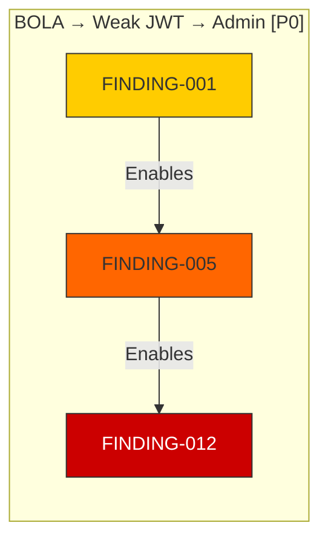

# Attack Planning & Chain Analysis

Build optimal attack chains from individual findings and prioritize exploitation paths.

## When to Use
- Multiple findings discovered across different agents/phases
- Need to correlate findings into complete attack narratives
- Prioritizing exploitation targets for maximum impact
- Building exploitation roadmaps with HITL approval
- Mapping attack paths to MITRE ATT&CK and D3FEND

## Core Capabilities

### 8 Attack Chain Templates

| Template | Pattern | MITRE Path | D3FEND Counters | Priority |
|----------|---------|------------|-----------------|----------|
| BOLA → JWT → Admin | IDOR + Weak JWT + Auth Bypass | T1190 → T1552.004 → T1078 | D3-PSA, D3-KDU, D3-AA | P0 |
| Subdomain → SSRF → Metadata | Takeover + SSRF + Cloud Metadata | T1590.005 → T1190 → T1552.005 | D3-DNST, D3-SFI, D3-CSM | P0 |
| Cred Spray → Lateral | Password Spray + Valid Creds + SSH/RDP | T1110.003 → T1078 → T1021.004 | D3-BA, D3-ARA, D3-NA | P1 |
| Info → SSRF → RCE | Disclosure + SSRF + Code Exec | T1592 → T1190 → T1059 | D3-PSA, D3-SFI, D3-EAA | P0 |
| XSS → Hijack → Takeover | XSS + Session Theft + Account | T1190 → T1552.004 → T1078 | D3-WAF, D3-PSA, D3-ARA | P1 |
| Container → Cloud | Escape + Metadata + IAM | T1610 → T1552.005 → T1078.004 | D3-CSM, D3-IAM, D3-SFI | P0 |
| Deserial → Persist | Insecure Deserial + RCE + Persist | T1059 → T1059.001 → T1505 | D3-EAA, D3-SCA, D3-HSA | P0 |
| Crypto → MITM → Creds | Weak TLS + MITM + Cred Theft | T1557 → T1040 → T1552 | D3-CH, D3-CTA, D3-NTA | P1 |

### Chain Scoring Methodology
```yaml
Chain Confidence: min(individual_confidences)  # Weakest link
Chain Severity: max(individual_severities)     # Final impact
Chain Complexity: count(steps)                 # Operational difficulty
```

### Prioritization Matrix
| Priority | Criteria | Action |
|----------|----------|--------|
| P0 - Critical | RCE/full compromise, high confidence | Immediate HITL for exploitation |
| P1 - High | Significant data access, medium+ confidence | Next exploitation window |
| P2 - Medium | Limited access, or low confidence | Validate before exploitation |
| P3 - Low | Theoretical, not validated | Monitor, validate later |

## Dynamic Correlation

For findings not matching templates, the system:
1. Groups findings by target
2. Sorts by severity × confidence
3. Maps techniques to kill chain phases
4. Builds plausible progression chains
5. Assigns roles: reconnaissance → initial_access → execution → persistence → privilege_escalation → lateral_movement → objective

## Mermaid Diagram Generation



## HITL Approval Workflow

```yaml
for each chain:
  - Format: name, priority, score, steps with MITRE/D3FEND
  - Send to Telegram with /go chain <id> or /hold chain <id>
  - Wait for operator decision (timeout: 300s)
  - Log decision in audit trail
  - Approved → exploitation queue
  - Rejected → logged, operator notes recorded
```

## Exploitation Roadmap Output

```yaml
roadmap:
  - chain: "BOLA → Weak JWT → Admin"
    step: 1
    finding_id: "FINDING-001"
    role: "initial_access"
    technique: "T1190"
    action: "Exploit BOLA on /api/users/{id}"
    approval_required: true
    estimated_time: "15-30 min"
```

## Integration Points

| Agent | Input | Output |
|-------|-------|--------|
| SCANNERS | All findings | Correlated chains |
| ATTACK-PLANNER | Chains | Prioritized targets, roadmap |
| HUNTER | Chains + logic flaws | Novel chains, creative paths |
| EXPLOITER | Approved chains | Exploitation results |
| SWARM-ORCHESTRATOR | Chains | Phase coordination, HITL |
| REPORTER | Chains + results | Executive/technical reports |

## Skill Triggers
- "attack chain"
- "exploitation path"
- "prioritize targets"
- "build attack narrative"
- "correlate findings"