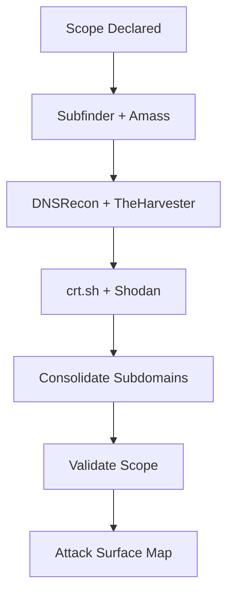
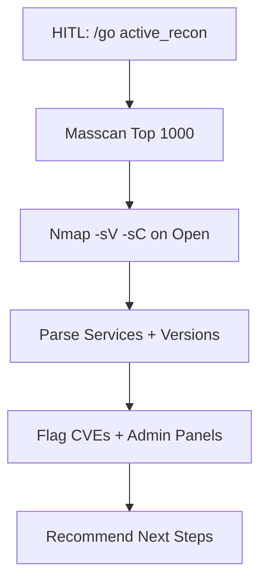
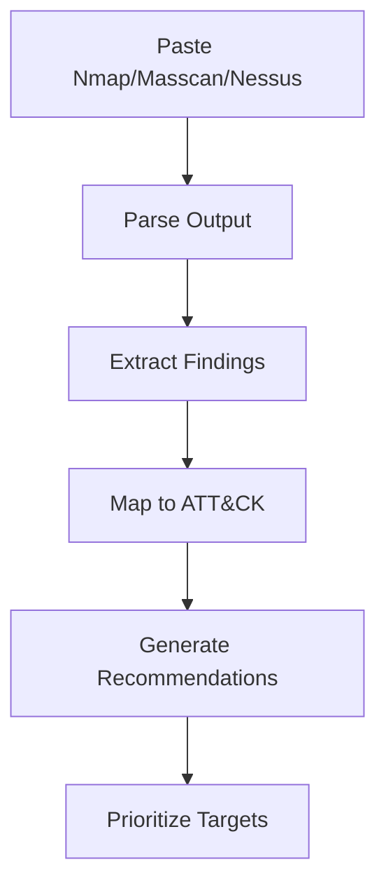

# Reconnaissance Advisory

Expert reconnaissance analysis, enumeration, and attack surface mapping with mandatory scope enforcement.

## When to Use
- Planning reconnaissance strategy for new engagement
- Analyzing scan output (Nmap, Masscan, Nessus, Nikto, Amass, Subfinder)
- Identifying attack surface from raw tool output
- Executing passive/active reconnaissance against authorized targets
- Validating scope before active scanning

## Core Capabilities

### Passive Reconnaissance (No Scope Declaration Required for Advisory)
| Tool | Purpose | Output Analysis |
|------|---------|-----------------|
| Subfinder | Subdomain discovery | New assets, wildcard expansion |
| Amass (passive) | OSINT subdomain enum | Historical DNS, cert transparency |
| DNSRecon | DNS enumeration | Zone transfers, record types |
| TheHarvester | Email/name/subdomain OSINT | Credentials, hosts, social profiles |
| crt.sh | Certificate transparency | Subdomains, issuers, expiry |
| Shodan/Censys | Internet asset search | Open ports, banners, vulns |

### Active Reconnaissance (Scope Declaration + HITL Required)
| Tool | Purpose | HITL Checkpoint |
|------|---------|-----------------|
| Nmap | Port scan, service enum, NSE | Before active scanning |
| Masscan | High-speed port scan | Before brute force enumeration |
| DNS zone transfer | AXFR/IXFR attempts | Before zone transfer |

### Scan Output Analysis
```yaml
nmap_analysis:
  - Extract open ports and services
  - Identify outdated versions (CVEs)
  - Flag exposed admin panels
  - Detect weak protocols (SSLv2, TLS 1.0)
  - Map to ATT&CK techniques

masscan_analysis:
  - Consolidate port lists
  - Identify unexpected open ports
  - Prioritize for Nmap follow-up

nessus_analysis:
  - Parse plugin output
  - Deduplicate findings
  - Map to CVEs and CVSS
  - Generate remediation priority
```

## Scope Enforcement (MANDATORY)

### Session Initialization
```yaml
before_any_execution:
  - Ask operator for:
    engagement_type: [external, internal, webapp, cloud, wireless]
    authorized_ips: [CIDR ranges, individual IPs]
    authorized_domains: [wildcards supported: *.example.com]
    authorized_urls: [specific endpoints]
    rate_limits: [requests/second, concurrent]
    time_restrictions: [allowed windows]
    destructive_actions_allowed: [yes/no]
  - Store scope declaration
  - Validate against config scope
```

### Pre-Execution Validation
```yaml
before_each_command:
  - target in authorized_ips OR
  - target matches authorized_domains OR
  - target starts with authorized_urls
  - action not in destructive_keywords OR destructive_allowed
  - within rate_limits and time_restrictions
```

### Destructive Keywords Blocked Without Authorization
```
delete, drop, remove, destroy, wipe, format, dos, flood, spray, brute, crash
```

## Procedures

### 1. Passive Recon Workflow


### 2. Active Recon Workflow


### 3. Scan Analysis Workflow


## Scope Declaration Format
```json
{
  "engagement_type": "external",
  "authorized_ips": ["192.168.1.0/24", "10.0.0.5"],
  "authorized_domains": ["*.example.com", "api.example.com"],
  "authorized_urls": ["https://app.example.com/", "https://api.example.com/v1/"],
  "rate_limits": {"requests_per_second": 50, "concurrent": 10},
  "time_restrictions": {"start": "09:00", "end": "18:00", "timezone": "UTC"},
  "destructive_actions_allowed": false
}
```

## Recommendations Engine

| Finding Pattern | Recommendation |
|-----------------|----------------|
| SSH open (port 22) | Test SSH version, credentials, key auth |
| SMB open (445) | Enum shares, test null session, check EternalBlue |
| RDP open (3389) | Check BlueKeep, test NLA, credential spray |
| Web servers (80/443) | Run nikto, nuclei, ffuf, directory enum |
| Database ports (3306, 5432, 1433) | Test default creds, version audit |
| LDAP (389/636) | Anonymous bind, enum users/groups |
| Kerberos (88) | AS-REP roasting, Kerberoasting |
| DNS (53) | Zone transfer, subdomain enum |

## Integration Points

| Agent | Consumes | Produces |
|-------|----------|----------|
| RECON-PASSIVE | Scope, domains | Subdomains, DNS, certs, OSINT |
| RECON-ADVISOR | Passive results, scope | Attack surface map, validated targets |
| RECON-ACTIVE | Validated targets | Host inventory, ports, services, OS |
| SCANNERS | Host inventory | Vulnerabilities, misconfigurations |
| ATTACK-PLANNER | All findings | Attack chains, exploitation roadmap |

## HITL Checkpoints
- Before active scanning (port scans, service enum)
- Before brute force enumeration (subdomain, DNS, credentials)
- Before any destructive action

## Skill Triggers
- "recon"
- "enumeration"
- "subdomain"
- "dns"
- "osint"
- "attack surface"
- "scope"