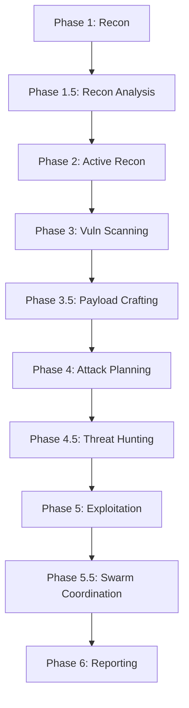

# Swarm Orchestration

Coordinate multi-agent penetration testing workflows and manage engagement lifecycles.

## When to Use
- Running full penetration testing engagements with multiple phases
- Coordinating parallel agent execution (recon, scanning, exploitation)
- Managing agent-to-agent handoffs and data flow
- Tracking progress across distributed workstreams
- Orchestrating complex red team operations

## Core Capabilities

### Phase Orchestration


### Agent Handoff Patterns
| From Agent | To Agent | Data Transferred |
|------------|----------|------------------|
| RECON-PASSIVE | RECON-ADVISOR | Subdomains, DNS, certificates, OSINT |
| RECON-ADVISOR | RECON-ACTIVE | Validated targets, attack surface map |
| RECON-ACTIVE | SCANNERS | Host inventory, port/service map |
| SCANNERS | ATTACK-PLANNER | All findings with scores |
| ATTACK-PLANNER | HUNTER | Prioritized chains, approved targets |
| HUNTER | EXPLOITER | Approved chains with HITL |
| EXPLOITER | SWARM-ORCHESTRATOR | Access gained, credentials, lateral paths |
| SWARM-ORCHESTRATOR | REPORTER | All findings, chains, evidence, timeline |

### Progress Tracking
- Phase completion status
- Agent health and tool availability
- Finding count by severity
- HITL approval queue status
- Timeline events and decisions

## Procedures

### 1. Engagement Initialization
```yaml
steps:
  - Declare scope (mandatory)
  - Validate all targets in scope
  - Initialize agent registry
  - Send startup notification
  - Set phase to "intake"
```

### 2. Phase Execution Loop
```yaml
for each phase:
  - Check running state
  - Get agent instances
  - Verify tool availability
  - Execute agents in parallel/sequence
  - Merge results into shared context
  - Log phase transition
```

### 3. HITL Checkpoint Handling
```yaml
before_critical_action:
  - Build finding with proposed_action and risk
  - Send to Telegram with /go /hold options
  - Wait for operator decision
  - Log decision in audit trail
  - Proceed or halt based on response
```

### 4. Chain Approval Workflow
```yaml
for each attack_chain:
  - Format chain with MITRE/D3FEND
  - Send to operator via Telegram
  - Wait for /go chain <id> or /hold
  - Track approved/rejected chains
  - Feed approved to exploiter
```

## HITL Checkpoints
- Before starting new engagement phase
- Before delegating destructive tasks
- Before escalating privileges
- Before lateral movement
- Before data exfiltration
- Before chain exploitation

## Outputs
- Phase completion reports
- Agent execution summaries
- Consolidated findings
- Attack chain approvals
- Engagement timeline
- Final executive/technical reports