# 🦅 NIGHTFANG

**Autonomous Penetration Testing Swarm Agent Framework**

> An AI-powered pentesting orchestrator that coordinates specialized security agents to perform comprehensive, methodical penetration testing with human-in-the-loop controls, persistent state memory, and multi-framework industry mapping.

---

## 🏗️ Architecture

```
                    ┌────────────────────────┐
                    │        OPERATOR        │
                    │ (Telegram / Slack / UI)│
                    └───────────┬────────────┘
                                │ HITL Controls (/go, /hold, /stop, /terse)
                    ┌───────────▼────────────┐
                    │         NIGHTFANG       │
                    │   Master Orchestrator  │
                    │ (MEMORY, SOPS & Scope) │
                    └───────────┬────────────┘
         ┌──────────────────────┼──────────────────────┐
    ┌────▼────┐            ┌────▼────┐            ┌────▼────┐
    │  RECON  │            │ SCANNER │            │EXPLOITER│
    │  Swarm  │            │  Swarm  │            │  Swarm  │
    └────┬────┘            └────┬────┘            └────┬────┘
         │                      │                      │
    ┌────▼────┐            ┌────▼────┐            ┌────▼────┐
    │REPORTER │            │ MEMORY  │            │EVIDENCE │
    │ & Comms │            │ Manager │            │ & Vault │
    └─────────┘            └─────────┘            └─────────┘
```

## ✨ Key Capabilities

- **🐝 Swarm Architecture**: **17 specialized subagents** coordinated across **12 operational phases**.
- **🧠 Persistent Memory & State**: Long-term memory store (`MEMORY.md`), decision heuristics (`HEURISTICS.md`), and SOP runbooks (`SOPS.md`).
- **🤖 Telegram & Multi-Channel HITL**: Human-in-the-loop controls via Telegram, Slack, Discord, and Jira.
- **🪨 Toggleable Caveman Mode**: Optional 40–60% token reduction via `/terse on|off` or config flag.
- **📊 Dual-Scoring System**: Independent Confidence (1–10) + Severity (1–10) ranking on every finding.
- **🛡️ 6-Framework Cross-Mapping**: Mapped to **MITRE ATT&CK v19**, **NIST CSF 2.0**, **MITRE D3FEND**, **MITRE ATLAS**, **NIST AI RMF**, and **OWASP**.
- **🔌 Model Context Protocol (MCP)**: Native MCP integration for Playwright browser engines, threat intel feeds, and ticketing pipelines.
- **📋 Auto-Reporting & Walkthroughs**: 100% reproducible step-by-step walkthroughs with evidence artifacts and remediation roadmaps.
- **🎯 Strict Scope Enforcement**: Automated CIDR, IP, regex domain, and URL matching to guarantee zero out-of-scope traffic. Mandatory pre-execution `check_scope()` on every Bash-capable agent.

---

## 📁 Repository Structure

```
NIGHTFANG/
├── AGENTS.md                                # Master Orchestrator identity & HITL rules
├── GEMINI.md                                # Project-wide safety guidelines
├── MEMORY.md                                # Persistent agent memory & learned target patterns
├── SOPS.md                                  # Standard Operating Procedures (safety, rate limits, cleanup)
├── HEURISTICS.md                            # Triage heuristics & attack chain prioritization logic
├── TOOLS.md                                 # Complete tool inventory, timeouts & fallback matrix
├── README.md                                # This documentation
├── TUTORIAL.md                              # Complete operator runbook & simulation
├── .env.example                             # Environment variables template
├── config/
│   ├── engagement_template.yaml             # Engagement scope & credentials config
│   ├── personal_engagement.yaml             # Operator-calibrated engagement defaults
│   ├── subagents.yaml                       # Swarm agent registry & dependencies
│   ├── workflows.yaml                       # 12-phase execution lifecycle & deconfliction
│   └── mcp_servers.yaml                     # Model Context Protocol external tool servers
├── docs/
│   └── framework_mappings.md                # ATT&CK, NIST, D3FEND, ATLAS cross-mappings
├── templates/
│   ├── finding_template.md                  # Individual finding deliverable template
│   ├── full_report_template.md              # Executive penetration test report template
│   └── telegram_templates.md                # Standardized Telegram notification formats
├── scripts/
│   ├── scope_validator.py                   # CIDR, IP, and domain scope validator
│   ├── state_manager.py                     # Real-time state & memory manager
│   ├── telegram_bridge.py                   # Telegram bot HITL bridge
│   ├── multi_channel_notifier.py            # Slack, Discord & webhook alert bridge
│   └── report_compiler.py                   # Automated markdown report generator
├── .agents/
│   ├── skills/                              # 21 standardized agentskills.io skills
│   └── subagents/                           # 17 dedicated subagent operational prompts
├── nightfang/
│   ├── agents/                              # 17 agent implementations
│   │   ├── base.py                          # BaseAgent with scope enforcement & tier system
│   │   ├── recon_passive.py                 # OSINT, DNS, CT logs, subdomains
│   │   ├── recon_advisor.py                 # Scan analysis, scope enforcement, recommendations
│   │   ├── recon_active.py                  # Port scanning, service enumeration
│   │   ├── scanner_webapp.py                # OWASP Top 10 web testing
│   │   ├── scanner_api.py                   # REST/GraphQL/gRPC API testing
│   │   ├── scanner_network.py               # SMB, SSH, RDP, AD, Kerberos
│   │   ├── scanner_ssl.py                   # TLS config, certs, Heartbleed/POODLE
│   │   ├── scanner_cloud.py                 # AWS/Azure/GCP misconfigs, SSRF metadata
│   │   ├── scanner_ai.py                    # Prompt injection, tool abuse, RAG poisoning
│   │   ├── vuln_scanner.py                  # Nuclei, Nikto, Nmap vulners, CVE correlation
│   │   ├── payload_crafter.py               # Custom shells, WAF bypass, encoding
│   │   ├── attack_planner.py                # 8 chain templates, dynamic correlation, HITL
│   │   ├── hunter.py                        # Logic flaws, creative testing, chain diagrams
│   │   ├── swarm_orchestrator.py            # Multi-agent coordination, phase orchestration
│   │   ├── exploiter.py                     # Benign PoC exploitation (HITL per finding)
│   │   └── reporter.py                      # Executive/technical reports, MITRE/D3FEND
│   ├── core/
│   │   ├── config.py                        # YAML config loading with env var substitution
│   │   ├── orchestrator.py                  # 12-phase engagement coordinator
│   │   ├── memory.py                        # Persistent state (findings, assets, decisions, chains)
│   │   ├── scope.py                         # CIDR, IP, domain, URL scope validator
│   │   └── telegram_bot.py                  # Telegram HITL bot with /go, /hold, /stop, /terse
│   └── cli/
│       └── main.py                          # CLI entry point (nightfang start --config --phase)
├── .agents/
│   ├── skills/                              # 21 standardized agentskills.io skills
│   └── subagents/                           # 17 dedicated subagent operational prompts
└── engagements/                             # Sandboxed engagement logs and reports
```

---

## 🤖 The 17 Agents

| Agent | Tier | Phase | Purpose |
|-------|------|-------|---------|
| **RECON-PASSIVE** | 1 | 1 | OSINT, DNS, CT logs, subdomains, tech fingerprinting |
| **RECON-ADVISOR** | 2 | 1.5 | Scan analysis (Nmap, Masscan, Nessus), scope enforcement, recommendations |
| **RECON-ACTIVE** | 2 | 2 | Port scanning, service enumeration, OS fingerprinting |
| **SCANNER-WEBAPP** | 2 | 3 | OWASP Top 10 web testing (SQLi, XSS, IDOR, SSRF, auth bypass) |
| **SCANNER-API** | 2 | 3 | REST/GraphQL/gRPC API testing (BOLA, mass assignment, JWT) |
| **SCANNER-NETWORK** | 2 | 3 | SMB, SSH, RDP, AD, Kerberos, credential attacks |
| **SCANNER-SSL** | 1 | 3 | TLS config, certs, cipher suites, Heartbleed/POODLE |
| **SCANNER-CLOUD** | 2 | 3 | AWS/Azure/GCP misconfigs, IAM, S3, SSRF metadata |
| **SCANNER-AI** | 1 | 3 | Prompt injection, tool abuse, RAG poisoning, MCP audit |
| **VULN-SCANNER** | 1 | 3 | Nuclei, Nikto, Nmap vulners, CVE correlation, searchsploit |
| **PAYLOAD-CRAFTER** | 1 | 3.5 | Custom shells, WAF bypass, encoding/obfuscation, msfvenom |
| **ATTACK-PLANNER** | 1 | 4 | 8 chain templates, dynamic correlation, Mermaid diagrams, HITL approval |
| **HUNTER** | 1 | 4.5 | Logic flaws, race conditions, creative testing, novel chains |
| **SWARM-ORCHESTRATOR** | 1 | 5.5 | Multi-agent coordination, phase orchestration, chain approvals |
| **EXPLOITER** | 2 | 5 | Benign PoC exploitation (HITL per finding), cleanup verification |
| **REPORTER** | 1 | 6 | Executive/technical reports, MITRE/D3FEND, remediation roadmap |
| **BASE** | — | — | Scope enforcement, tier system, HITL, evidence collection |

**Tier System**: Tier 1 = Advisory (Read, Write, Edit, Grep, Glob, WebFetch, WebSearch). Tier 2 = Execution (Tier 1 + Bash). Every Tier 2 agent enforces mandatory `check_scope()` before any Bash command.

---

## ⚙️ Engagement Phases (12 Phases)

```mermaid
graph LR
    A[Phase 1: Recon] --> B[Phase 1.5: Recon Analysis]
    B --> C[Phase 2: Active Recon]
    C --> D[Phase 3: Vuln Scanning]
    D --> E[Phase 3.5: Payload Crafting]
    E --> F[Phase 4: Attack Planning]
    F --> G[Phase 4.5: Threat Hunting]
    G --> H[Phase 5: Exploitation]
    H --> I[Phase 5.5: Swarm Coordination]
    I --> J[Phase 6: Reporting]
```



| Phase | Agents | HITL | Description |
|-------|--------|------|-------------|
| **1. Recon** | RECON-PASSIVE, RECON-ADVISOR | No | Passive OSINT, DNS, CT logs, subdomains |
| **1.5 Recon Analysis** | RECON-ADVISOR | No | Scan output analysis, attack surface map, recommendations |
| **2. Active Recon** | RECON-ACTIVE | **Yes** | Port scanning, service enum (requires `/go`) |
| **3. Vuln Scanning** | 7 scanners (parallel) | No | Web, API, Network, Cloud, SSL, AI, Vuln |
| **3.5 Payload** | PAYLOAD-CRAFTER | **Yes** | Custom payloads, WAF bypass (requires `/go`) |
| **4. Attack Planning** | ATTACK-PLANNER | **Yes** | 8 chain templates, dynamic correlation, Mermaid diagrams |
| **4.5 Hunting** | HUNTER | No | Logic flaws, race conditions, creative chains |
| **5. Exploitation** | EXPLOITER | **Yes/per finding** | Benign PoC only (`id`, `whoami`, `version()`) |
| **5.5 Swarm Coord** | SWARM-ORCHESTRATOR | **Yes** | Post-exploitation coordination, lateral movement planning |
| **6. Reporting** | REPORTER | No | Executive + technical reports, MITRE/D3FEND mapping |

---

## 🎯 HITL Controls (Telegram)

| Command | Action | Scope |
|---------|--------|-------|
| `/go` | Approve current phase gate | Phase |
| `/go [ID]` | Approve exploitation of finding | Finding |
| `/go chain [ID]` | Approve attack chain exploitation | Chain |
| `/hold [ID]` | Reject/pause finding | Finding |
| `/hold chain [ID]` | Reject attack chain | Chain |
| `/hold` | Pause current phase | Phase |
| `/stop` | Emergency kill all | Global |
| `/status` | Live swarm status + finding counts | Global |
| `/findings` | List all findings with scores | Global |
| `/report` | Generate & send markdown report | Engagement |
| `/terse on\|off` | Toggle Caveman mode | Session |
| `/scope` | Show current scope boundaries | Engagement |
| `/evidence [ID]` | Send evidence for finding | Finding |
| `/chain [ID]` | Show attack chain diagram | Chain |

---

## 🧪 Quick Start

1. **Copy environment template:**
   ```bash
   cp .env.example .env
   # Edit .env with your TELEGRAM_BOT_TOKEN and TELEGRAM_CHAT_ID
   ```

2. **Configure engagement:**
   ```bash
   cp config/engagement_template.yaml config/my_engagement.yaml
   # Edit scope, credentials, rules of engagement
   ```

3. **Start engagement:**
   ```bash
   python3 -m nightfang.cli.main start --config config/my_engagement.yaml --phase full
   ```

4. **Control via Telegram:**
   - Receive finding alerts with Confidence/Severity scores
   - Reply `/go FINDING-001` to approve exploitation
   - Reply `/hold FINDING-001 "out of scope"` to reject
   - Use `/terse on` for compact mobile updates

---

## 🧠 Skills System (21 Skills)

All skills follow the standard `agentskills.io` format with YAML frontmatter + markdown body. Located in:
- `nightfang/skills/` — Primary runtime skills
- `.agents/skills/` — Mirror for external tooling (Claude Code, etc.)

| Skill | Domain | Description |
|-------|--------|-------------|
| `swarm-orchestration` | orchestration | Phase orchestration, agent handoffs, chain approval |
| `attack-planning` | attack-chain-analysis | 8 templates, dynamic correlation, roadmap |
| `recon-advisor` | reconnaissance | Scan analysis, scope enforcement, recommendations |
| `attack-chain-analysis` | attack-chain-analysis | 8 templates, dynamic correlation, Mermaid diagrams |
| `recon-passive` | reconnaissance | OSINT, DNS, CT logs, subdomains |
| `recon-active` | reconnaissance | Port scanning, service enum, OS fingerprinting |
| `webapp-testing` | webapp | OWASP Top 10, SQLi, XSS, IDOR, SSRF |
| `api-testing` | api | REST/GraphQL/gRPC, BOLA, mass assignment, JWT |
| `network-testing` | network | SMB, SSH, RDP, AD, Kerberos, pivoting |
| `payload-crafting` | payload | Custom shells, WAF bypass, encoding, msfvenom |
| `vulnerability-scanning` | vuln-scanning | Nuclei, Nikto, CVE correlation, searchsploit |
| `cloud-testing` | cloud | AWS/Azure/GCP, IAM, S3, SSRF metadata |
| `ssl-tls-testing` | ssl-tls | TLS config, certs, cipher suites, vuln checks |
| `llm-ai-security` | ai-security | Prompt injection, tool abuse, RAG poisoning, MCP |
| `hunting` | hunting | Logic flaws, race conditions, creative chains |
| `privilege-escalation` | post-exploitation | Linux/Windows privesc, AD escalation |
| `evidence-collection` | forensics | Chain of custody, HTTP capture, screenshots |
| `reporting` | reporting | Executive/technical reports, remediation roadmap |
| `remediation-advisor` | remediation | Code-level fixes, prioritization, compliance mapping |
| `scope-management` | governance | CIDR, IP, domain, URL scope validation |
| `telegram-hitl` | hitl | Telegram bot governance, /go, /hold, /terse |
| `token-optimizer` | performance | Caveman mode, 40-60% token reduction |

---

## 🛡️ Scope Enforcement

Every Tier 2 agent enforces **mandatory pre-execution scope checks**:

```python
# In agent code - REQUIRED before any Bash command
if not self.check_scope(target, "execute nmap scan"):
    return  # Blocked automatically

# Operator declares scope at session start:
scope = ScopeDeclaration(
    engagement_type="external",
    authorized_ips=["192.168.1.0/24", "10.0.0.5"],
    authorized_domains=["*.example.com", "api.example.com"],
    authorized_urls=["https://app.example.com/", "https://api.example.com/v1/"],
    rate_limits={"requests_per_second": 50, "concurrent": 10},
    time_restrictions={"start": "09:00", "end": "18:00", "timezone": "UTC"},
    destructive_actions_allowed=False
)
agent.declare_scope(scope)
```

**Violations are logged** to timeline and blocked automatically. Destructive keywords (`delete`, `drop`, `remove`, `dos`, `flood`, `spray`) require explicit `destructive_actions_allowed: true`.

---

## 📊 Dual Scoring & Framework Mapping

Every finding receives:
- **Confidence (1-10)**: How certain the vulnerability is real
- **Severity (1-10)**: Potential impact if exploited

Auto-mapped to:
- **MITRE ATT&CK v19** (T1190, T1059, T1068, T1021, T1558, etc.)
- **MITRE D3FEND** (D3-PSA, D3-ARA, D3-CSM, D3-KDU, etc.)
- **MITRE ATLAS** (AML.T0051, AML.T0043, etc.)
- **NIST CSF 2.0** (ID.RA, PR.IP, DE.CM, RS.AN, RC.CO)
- **NIST AI RMF** (MAP-1.5, MEASURE-2.6, MANAGE-2.4)
- **OWASP** (Top 10, API Top 10, LLM Top 10)
- **CWE / CVSS 3.1**

---

## ⚖️ Ethics & Authorization

> [!CAUTION]
> NIGHTFANG is strictly designed for **authorized security testing and educational research**. Explicit written authorization is mandatory prior to assessing any computer system or network. The framework includes multiple safety layers:
> - Mandatory scope declaration before any active testing
> - HITL approval required for all exploitation
> - Benign PoC only (`id`, `whoami`, `SELECT version()`)
> - Mandatory cleanup verification
> - Decision audit trail for compliance