# 🎓 NIGHTFANG — Complete Operator Tutorial & Runbook

Welcome to **NIGHTFANG**. This guide provides an end-to-end walkthrough on how to configure, operate, and master the autonomous penetration testing swarm framework with Human-in-the-Loop (HITL) Telegram controls, toggleable token optimization, and multi-framework industry mapping.

---

## Table of Contents
1. [System Overview & Architecture](#1-system-overview--architecture)
2. [Prerequisites & Environment Setup](#2-prerequisites--environment-setup)
3. [Telegram Bot Integration Setup](#3-telegram-bot-integration-setup)
4. [Configuring Your Engagement](#4-configuring-your-engagement)
5. [The Dual-Scoring Ranking Matrix](#5-the-dual-scoring-ranking-matrix)
6. [Human-in-the-Loop (HITL) Protocol & Commands](#6-human-in-the-loop-hitl-protocol--commands)
7. [Toggleable Token Optimizer (Caveman Mode)](#7-toggleable-token-optimizer-caveman-mode)
8. [Swarm Agents & Skill Delegation](#8-swarm-agents--skill-delegation)
9. [End-to-End Engagement Walkthrough (Realistic Simulation)](#9-end-to-end-engagement-walkthrough-realistic-simulation)
10. [Report Generation & Reproduction Verification](#10-report-generation--reproduction-verification)
11. [Troubleshooting, Safety, & Best Practices](#11-troubleshooting-safety--best-practices)

---

## 1. System Overview & Architecture

NIGHTFANG acts as the **Central Master Orchestrator**, managing a swarm of **17 specialized subagents** across **12 engagement phases**.

```
                                  ┌───────────────────────┐
                                  │   OPERATOR / LEAD     │
                                  │   (Telegram Mobile)   │
                                  └───────────┬───────────┘
                                              │ Telegram /go, /hold, /stop, /terse
                                  ┌───────────▼───────────┐
                                  │  NIGHTFANG Orchestrator  │
                                  │ (Scope, Memory, HITL) │
                                  └───────────┬───────────┘
               ┌──────────────────────────────┼──────────────────────────────┐
               │                              │                              │
     ┌─────────▼─────────┐          ┌─────────▼─────────┐          ┌─────────▼─────────┐
     │    RECON SWARM    │          │   SCANNER SWARM   │          │  EXPLOITER SWARM  │
     ├───────────────────┤          ├───────────────────┤          ├───────────────────┤
     │ • RECON-PASSIVE   │          │ • SCANNER-WEBAPP  │          │ • EXPLOITER       │
     │ • RECON-ADVISOR   │          │ • SCANNER-API     │          │ • HUNTER (Chains) │
     │ • RECON-ACTIVE    │          │ • SCANNER-NETWORK │          │ • SWARM-ORCHESTRATOR│
     │                   │          │ • SCANNER-SSL     │          │                   │
     │                   │          │ • SCANNER-AI      │          │                   │
     │                   │          │ • SCANNER-CLOUD   │          │                   │
     │                   │          │ • VULN-SCANNER    │          │                   │
     └─────────┬─────────┘          └─────────┬─────────┘          └─────────┬─────────┘
               │                              │                              │
               └──────────────────────────────┼──────────────────────────────┘
                                              │
                                    ┌─────────▼─────────┐
                                    │  REPORTING SWARM  │
                                    ├───────────────────┤
                                    │ • REPORTER        │
                                    │ • REMEDIATION     │
                                    │ • EVIDENCE-VAULT  │
                                    └───────────────────┘
```

### Engagement Phases (12 Phases)

```mermaid
graph LR
    A[Phase 1: Recon] --> B[Phase 1.5: Recon Analysis]
    B --> C[Phase 2: Active Recon]
    C --> D[Phase 3: Vuln Scanning]
    D --> E[Phase 3.5: Payload Crafting]
    E --> F[Phase 4: Attack Planning]
    F --> G[Phase 4.5: Threat Hunting]
    G --> H[Phase 5: Exploitation]
    H --> I[Phase 5.5: Swarm Coordination]
    I --> J[Phase 6: Reporting]
```



| Phase | Agents | HITL | Description |
|-------|--------|------|-------------|
| **1. Recon** | RECON-PASSIVE, RECON-ADVISOR | No | Passive OSINT, DNS, CT logs, subdomains |
| **1.5 Recon Analysis** | RECON-ADVISOR | No | Scan output analysis, attack surface map, recommendations |
| **2. Active Recon** | RECON-ACTIVE | **Yes** | Port scanning, service enum (requires `/go`) |
| **3. Vuln Scanning** | 7 scanners (parallel) | No | Web, API, Network, Cloud, SSL, AI, Vuln |
| **3.5 Payload** | PAYLOAD-CRAFTER | **Yes** | Custom payloads, WAF bypass (requires `/go`) |
| **4. Attack Planning** | ATTACK-PLANNER | **Yes** | 8 chain templates, dynamic correlation, Mermaid diagrams |
| **4.5 Hunting** | HUNTER | No | Logic flaws, race conditions, creative chains |
| **5. Exploitation** | EXPLOITER | **Yes/per finding** | Benign PoC only (`id`, `whoami`, `version()`) |
| **5.5 Swarm Coord** | SWARM-ORCHESTRATOR | **Yes** | Post-exploitation coordination, lateral movement planning |
| **6. Reporting** | REPORTER | No | Executive + technical reports, MITRE/D3FEND mapping |

---

## 2. Prerequisites & Environment Setup

### Required Tools (Installed on Target System / Host)
- **Recon & Discovery**: `nmap`, `masscan`, `whois`, `dig`, `subfinder`, `amass`, `whatweb`, `wafw00f`
- **Web & API Testing**: `nikto`, `gobuster`, `ffuf`, `nuclei`, `sqlmap`, `dalfox`, `commix`, `jwt_tool`, `katana`, `arjun`
- **Network & Exploitation**: `metasploit-framework`, `hydra`, `crackmapexec` / `netexec`, `impacket`, `testssl.sh`
- **Python Runtime**: Python 3.10+ with `requests`, `pyyaml`

---

## 3. Telegram Bot Integration Setup

NIGHTFANG communicates live updates and requests exploitation permissions via Telegram.

### Step 1: Create your Telegram Bot
1. Open Telegram and search for `@BotFather`.
2. Send `/newbot` and follow prompts (e.g., Name: `NIGHTFANG Pentest Bot`, Username: `nightfang_sec_bot`).
3. Save the **HTTP API Token** (e.g., `123456789:ABCdefGHIjklMNOpqrsTUVwxyz`).

### Step 2: Obtain your Telegram Chat ID
1. Message `@userinfobot` or `@GetIDsBot` on Telegram.
2. Note your numerical **Chat ID** (e.g., `987654321`).

### Step 3: Populate Config
Insert your token and chat ID into `config/engagement_template.yaml`:
```yaml
telegram:
  bot_token: "123456789:ABCdefGHIjklMNOpqrsTUVwxyz"
  chat_id: "987654321"
```

---

## 4. Configuring Your Engagement

Copy `config/engagement_template.yaml` to `engagements/target_engagement.yaml` and specify your scope:

```yaml
engagement:
  name: "Acme Corp Web & API Pentest"
  client: "Acme Corporation"
  type: "greybox"
  start_date: "2026-09-01"
  end_date: "2026-09-05"
  operator: "@SecurityLead"

scope:
  in_scope:
    domains:
      - "acme.example.com"
      - "*.api.acme.example.com"
    ips:
      - "198.51.100.10"
      - "198.51.100.11"
    urls:
      - "https://acme.example.com/*"
      - "https://api.acme.example.com/v1/*"
    ports:
      - "80,443,8080,8443"

  out_of_scope:
    domains:
      - "payments.acme.example.com"
    ips:
      - "198.51.100.1"
    urls:
      - "https://acme.example.com/admin/purge_database"
    notes:
      - "Strictly no DoS / Stress testing."
      - "Do not alter financial records."

rules:
  token_efficiency: false # Toggle Caveman mode on/off
```

---

## 5. The Dual-Scoring Ranking Matrix

Every finding reported by NIGHTFANG is rated on two independent 1-to-10 scales:

```
                  ┌─────────────────────────────────────────────────────────────┐
                  │                 SEVERITY SCORE (1-10)                       │
                  │ (1-2 Info | 3-4 Low | 5-6 Med | 7-8 High | 9-10 Critical)   │
┌─────────────────┼───────────────────┬───────────────────┬─────────────────────┤
│ CONFIDENCE (1-10)│ 1 - 4 (Low Impact)│ 5 - 7 (Med Impact)│ 8 - 10 (Crit Impact)│
├─────────────────┼───────────────────┼───────────────────┼─────────────────────┤
│ 1 - 3 (Inferred)│ Version banner info│ Theoretical CVE   │ Potential blind RCE │
│                 │ (e.g. Apache 2.4) │ (untested banner) │ (requires verify)   │
├─────────────────┼───────────────────┼───────────────────┼─────────────────────┤
│ 4 - 6 (Probable)│ Missing Sec Header│ Timing anomaly on │ Error-based SQLi    │
│                 │ confirmed         │ IDOR endpoint     │ stack trace seen    │
├─────────────────┼───────────────────┼───────────────────┼─────────────────────┤
│ 7 - 9 (Verified)│ Cleartext cookie  │ BOLA verified via │ SQLi / Auth Bypass  │
│                 │ extracted         │ 2nd account test  │ PoC query proven    │
├─────────────────┼───────────────────┼───────────────────┼─────────────────────┤
│ 10 (Exploited)  │ Best practice PoC │ Data modified /   │ Full RCE / Admin    │
│                 │ executed          │ records accessed  │ Shell Achieved      │
└─────────────────┴───────────────────┴───────────────────┴─────────────────────┘
```

---

## 6. Human-in-the-Loop (HITL) Protocol & Commands

NIGHTFANG will **NEVER** run intrusive exploitation commands without explicit operator authorization.

### Telegram Commands

| Command | Action | Scope |
|---------|--------|-------|
| `/go` | Approve current phase gate to proceed | Phase |
| `/go [ID]` | Approve exploitation of a specific finding (e.g. `/go NIGHTFANG-003`) | Finding |
| `/go chain [ID]` | Approve attack chain exploitation (e.g. `/go chain CHAIN-BOLA-001`) | Chain |
| `/hold [ID]` | Reject or pause testing on that vector | Finding |
| `/hold chain [ID]` | Reject attack chain | Chain |
| `/hold` | Pause current phase | Phase |
| `/stop` | Immediate emergency shutdown of all active subagents | Global |
| `/status` | Get current progress, active swarm agents, and finding counts | Global |
| `/findings` | List all discovered findings with dual scores & ATT&CK IDs | Global |
| `/report` | Generate and export real-time report markdown | Engagement |
| `/terse on` | **Enable Caveman Mode** (40-60% token savings, punchy telegram updates) | Session |
| `/terse off` | **Disable Caveman Mode** (standard conversational updates) | Session |
| `/scope` | Show current scope boundaries | Engagement |
| `/evidence [ID]` | Send evidence for finding | Finding |
| `/chain [ID]` | Show attack chain diagram | Chain |

### HITL Checkpoints by Phase

| Phase | Checkpoint | What Happens |
|-------|------------|--------------|
| 2. Active Recon | `/go` | Port scanning begins on in-scope targets |
| 3.5 Payload | `/go` | Custom payload generation begins |
| 4. Attack Planning | `/go chain [ID]` | Attack chain added to exploitation queue |
| 5. Exploitation | `/go [FINDING-ID]` | Benign PoC executed (`id`, `whoami`, `version()`) |
| 5.5 Swarm Coord | `/go` | Lateral movement, privilege escalation coordination |
| Any | `/hold [ID]` | Finding/chain paused, logged with reason |
| Any | `/stop` | **EMERGENCY** - All agents killed immediately |

---

## 7. Toggleable Token Optimizer (Caveman Mode)

NIGHTFANG includes an integrated **Caveman / Terse Mode** that reduces token usage by 40-60% during scans:

### How to Toggle:
1. **In Config**: Set `token_efficiency: true` in `config/engagement_template.yaml`.
2. **On Telegram / Chat**: Send `/terse on` or `/terse off` at any time.

### How it Behaves:
- **During Recon & Scans**: Strips conversational filler, producing compact, high-density telemetry.
- **On Telegram**: Formats compact alert cards for faster mobile triage.
- **Code & Commands**: Every `curl`, `nmap`, and payload remains **100% exact**.
- **Phase 6 Final Deliverables**: Automatically rendered in **formal executive English** for clients and auditors.

---

## 8. Swarm Agents & Skill Delegation

NIGHTFANG orchestrates **17 specialized agents** across **21 skills** in **12 phases**:

### Tier System
- **Tier 1 (Advisory)**: Read, Write, Edit, Grep, Glob, WebFetch, WebSearch
- **Tier 2 (Execution)**: Tier 1 + Bash (mandatory `check_scope()` before every command)

| Swarm Agent | Tier | Primary Skills | Phase | Objective |
|-------------|------|----------------|-------|-----------|
| **RECON-PASSIVE** | 1 | `recon-passive`, `scope-management` | 1 | Subdomain enum, WHOIS, DNS, cert logs without packet contact |
| **RECON-ADVISOR** | 2 | `recon-advisor`, `recon-passive`, `recon-active`, `scope-management` | 1, 1.5 | Scan analysis, scope enforcement, recommendations |
| **RECON-ACTIVE** | 2 | `recon-active`, `scope-management` | 2 | Nmap scans, service detection, port validation within scope |
| **SCANNER-WEBAPP** | 2 | `webapp-testing`, `evidence-collection` | 3 | OWASP Top 10 web testing (XSS, SQLi, SSRF, IDOR) |
| **SCANNER-API** | 2 | `api-testing`, `evidence-collection` | 3 | REST/GraphQL BOLA, mass assignment, token analysis |
| **SCANNER-AI** | 1 | `llm-ai-security`, `evidence-collection` | 3 | OWASP Top 10 for LLMs, prompt injection, MCP tool abuse |
| **SCANNER-NETWORK** | 2 | `network-testing`, `evidence-collection` | 3 | SMB, SSH, RDP, Kerberos, service misconfiguration |
| **SCANNER-SSL** | 1 | `ssl-tls-testing` | 3 | Cipher strength, Heartbleed/POODLE, cert expiration |
| **SCANNER-CLOUD** | 2 | `cloud-testing`, `evidence-collection` | 3 | AWS/Azure/GCP bucket permissions, IAM & metadata checks |
| **VULN-SCANNER** | 1 | `vulnerability-scanning` | 3 | Automated Nuclei template matching & CVE correlation |
| **PAYLOAD-CRAFTER** | 1 | `payload-crafting`, `evidence-collection` | 3.5 | Custom shells, WAF bypass, encoding/obfuscation, msfvenom |
| **ATTACK-PLANNER** | 1 | `attack-planning`, `attack-chain-analysis` | 4 | 8 chain templates, dynamic correlation, Mermaid diagrams, HITL approval |
| **HUNTER** | 1 | `hunting`, `attack-chain-analysis` | 4.5 | Logic flaws, race conditions, compound multi-step kill chains |
| **SWARM-ORCHESTRATOR** | 1 | `swarm-orchestration`, `attack-chain-analysis` | 5.5 | Multi-agent coordination, phase orchestration, chain approval workflow |
| **EXPLOITER** | 2 | `payload-crafting`, `privilege-escalation` | 5 | Targeted exploit execution on `/go` approval |
| **REPORTER** | 1 | `reporting`, `remediation-advisor` | 6 | Structured reports, reproduction guides, Jira/Slack exports |
| **BASE** | — | Scope enforcement, tier system, HITL, evidence collection | All | Foundation for all agents |

---

## 9. End-to-End Engagement Walkthrough (Realistic Simulation)

### Step 1: Launch Engagement
```bash
python3 -m nightfang.cli.main start --config config/my_engagement.yaml --phase full
```

### Step 2: Phase 1 — Passive Reconnaissance
- **RECON-PASSIVE** runs `subfinder`, `crt.sh`, `dig`, `amass`, `theharvester`.
- **RECON-ADVISOR** analyzes outputs, builds attack surface map.
- Telegram notification sent to operator with asset count.

### Step 3: Phase 1.5 — Recon Analysis
- **RECON-ADVISOR** parses passive outputs, validates scope, recommends active targets.
- Telegram: *"Passive recon complete. 247 subdomains discovered. 23 in scope. Ready for active?"*

### Step 4: Phase 2 — Active Reconnaissance (HITL Gate)
- NIGHTFANG asks via Telegram: *"Ready to run nmap port scans on 23 in-scope hosts. Proceed?"*
- Operator replies: `/go`
- **RECON-ACTIVE** identifies open ports, services, versions.

### Step 5: Phase 3 — Parallel Scanning & AI Probing
- **SCANNER-WEBAPP**, **SCANNER-API**, **SCANNER-NETWORK**, **SCANNER-SSL**, **SCANNER-CLOUD**, **SCANNER-AI**, **VULN-SCANNER** engage simultaneously.
- **Finding #1**: BOLA on `/api/v1/users/{id}/profile` (Severity 8/10, Confidence 8/10, ATT&CK T1190).
- **Finding #2**: Prompt Injection & Guardrail Bypass on `/api/v1/ai/assistant` (Severity 7/10, Confidence 9/10, ATLAS AML.T0051).
- **Finding #3**: SMB Null Session on `198.51.100.10:445` (Severity 7/10, Confidence 10/10).

### Step 6: Phase 3.5 — Payload Crafting (HITL)
- NIGHTFANG asks: *"Generate custom payloads for 3 confirmed findings. Proceed?"*
- Operator: `/go`
- **PAYLOAD-CRAFTER** generates custom shells, WAF bypasses, encoded variants.

### Step 7: Phase 4 — Attack Planning (HITL per Chain)
- **ATTACK-PLANNER** correlates findings into 8 template chains + dynamic chains.
- **Chain #1**: BOLA → Weak JWT → Admin Panel (P0, Score 8.4)
- **Chain #2**: Subdomain Takeover → SSRF → Cloud Metadata (P0, Score 8.2)
- **Chain #3**: Credential Spray → Valid Creds → Lateral Movement (P1, Score 7.5)
- Telegram sends Mermaid diagrams for each chain.
- Operator: `/go chain CHAIN-BOLA-001` and `/go chain CHAIN-SUBDOMAIN-002`

### Step 8: Phase 4.5 — Threat Hunting
- **HUNTER** finds logic flaw: Race condition on `/api/v1/billing/refund` + BOLA = duplicate refunds.
- Novel chain discovered: Race Condition + BOLA → Financial Impact (P1, Score 7.8).

### Step 9: Phase 5 — Exploitation (HITL per Finding)
- Operator sends: `/go NIGHTFANG-001` (BOLA)
- **EXPLOITER** executes benign verification query, proves access. Confidence updated to **10/10**.
- Operator sends: `/go NIGHTFANG-002` (Prompt Injection)
- **EXPLOITER** executes system prompt extraction, proves guardrail bypass. Confidence **10/10**.

### Step 10: Phase 5.5 — Swarm Coordination (HITL)
- **SWARM-ORCHESTRATOR** coordinates post-exploitation: lateral movement via SMB, AD enumeration.
- Operator approves lateral movement: `/go`
- Credentials harvested, BloodHound paths mapped.

### Step 11: Phase 6 — Final Deliverable
- **REPORTER** compiles `engagements/acme_engagement_report.md`.
- Executive summary + technical walkthrough + Mermaid chain diagrams + remediation roadmap.
- Automatically opens Jira security ticket and dispatches Telegram summary.

---

## 10. Report Generation & Reproduction Verification

Every report generated by NIGHTFANG guarantees 100% reproduction accuracy:

```markdown
### Steps to Reproduce Finding #NIGHTFANG-001:

1. Authenticate as low-privileged test user:
   curl -s -X POST https://api.acme.example.com/v1/auth/login \
     -H "Content-Type: application/json" \
     -d '{"username":"test_qa_user","password":"Password123!_Secure"}'
   
   Response returns JWT token: eyJhbGci...

2. Execute BOLA request attempting to view Admin User (ID 1):
   curl -s -X GET https://api.acme.example.com/v1/users/1/profile \
     -H "Authorization: Bearer ***"

3. Verification:
   Observe HTTP 200 OK with full PII and internal API tokens for user ID 1.
```

### Report Deliverables
- **Executive Summary** (1-page, board-ready)
- **Technical Findings** (dual scores, MITRE/D3FEND/ATLAS mappings)
- **Attack Chain Diagrams** (Mermaid, color-coded by role)
- **Remediation Roadmap** (P0→P3 with effort estimates)
- **Evidence Index** (command logs, HTTP captures, screenshots)
- **Compliance Mapping** (NIST CSF, PCI-DSS, HIPAA, SOC2 as applicable)

---

## 11. Troubleshooting, Safety, & Best Practices

1. **Scope Boundary Safety**: NIGHTFANG automatically matches every target host against CIDR/domain regex. Any third-party host is automatically blocked unless explicitly listed in `in_scope`.

2. **Emergency Stop**: Send `/stop` at any time on Telegram to immediately kill all running subagents and network processes.

3. **Caveman Mode Efficiency**: Use `/terse on` for large scans to cut token costs by up to 60%.

4. **Artifact Cleanup**: After any exploit test, NIGHTFANG verifies that temporary files or test payloads created on target systems are cleaned up.

5. **Rate Limit Control**: Adjust `max_scan_rate: 50` in your YAML config if testing environments with aggressive WAFs or load constraints.

6. **Scope Declaration**: Always declare scope before active phases. Use `/scope` to verify current boundaries.

7. **Evidence Preservation**: All command outputs, HTTP traffic, and screenshots are saved with SHA256 hashes for chain of custody.

---

*🦅 NIGHTFANG Swarm Framework — Engineered for precision, speed, and safety.*