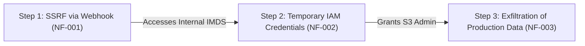

# Attack Chain Analysis Skill

Correlates individual vulnerabilities discovered across different agents and phases into coherent, compound attack narratives.

## Core Capabilities

### 1. Cyber Kill Chain Mapping
Map isolated findings into end-to-end compromise paths:

```
[Reconnaissance] ➔ [Weaponization] ➔ [Delivery] ➔ [Exploitation] ➔ [Privilege Escalation] ➔ [Lateral Movement] ➔ [Objectives]
```

| Phase | Common Discovered Findings |
| :--- | :--- |
| **Reconnaissance** | Exposed `.git`, WHOIS disclosures, subdomains, open ports |
| **Initial Access** | Web/API injection (SQLi, SSTI), public default credentials, unauthenticated upload |
| **Execution** | Command injection, deserialization RCE, agent tool abuse |
| **Privilege Escalation**| Sudo misconfiguration, weak token generation, BOLA to admin API |
| **Lateral Movement** | Internal SSRF to metadata service, extracted database credentials |
| **Objectives** | Production database exfiltration, host takeover |

### 2. Connection Analysis Process
1. **Inventory**: Collect all findings recorded adhering to `schemas/finding.md`.
2. **Link Formulation**: Identify prerequisite-to-enabler relationships:
   - *Finding A (Information Leak)* exposes internal API tokens.
   - *Finding B (SSRF)* enables reaching the internal API endpoint.
   - *Finding C (Admin Endpoint)* accepts the leaked tokens to grant administrative privileges.
3. **Chain Prioritization Formula**:
   Prioritize candidate chains using the weighted score:
   $$\text{Priority Score} = (\text{Max Severity} \times 0.6) + (\text{Min Confidence} \times 0.4) - (\text{Step Count} \times 0.2)$$

### 3. Visualization Standard
Construct Mermaid diagrams illustrating the full kill chain sequence:



## Output
- Compound attack chain objects.
- Visual Mermaid diagrams ready for final reporting.
