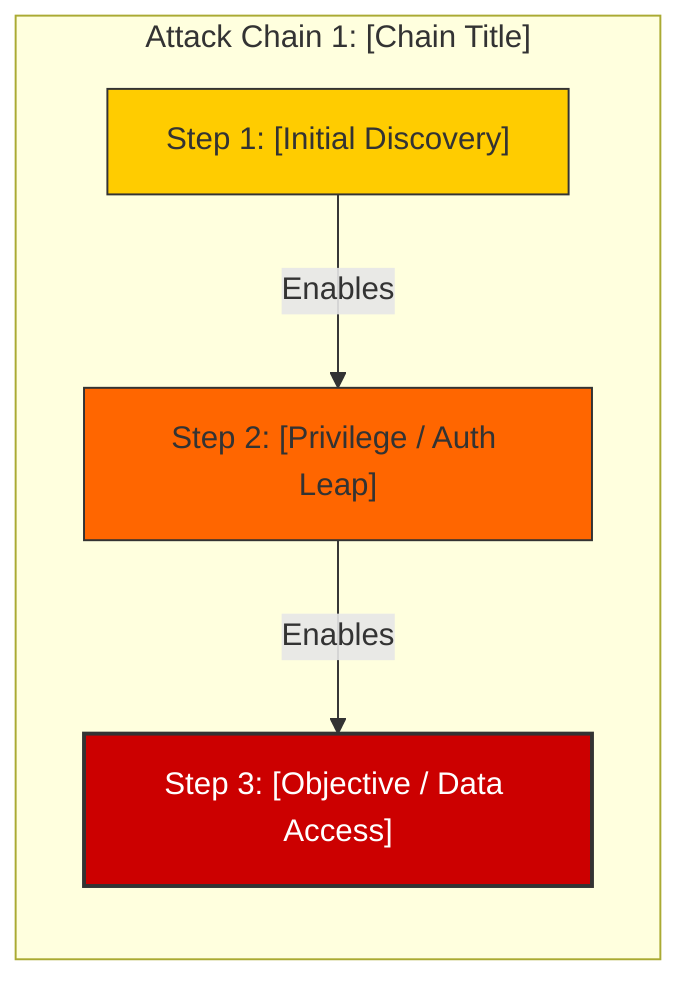

# 🦅 Penetration Testing Assessment Report
**Engagement:** [ENGAGEMENT_NAME]
**Target Organization:** [CLIENT_NAME]
**Assessment Window:** [START_DATE] – [END_DATE]
**Lead Orchestrator:** HERMES / OPENCLAW Framework
**Operator Handle:** [OPERATOR_HANDLE]

---

## 1. Executive Summary

### 1.1 Engagement Purpose
[Brief summary of engagement goals, authorization, and scope parameters.]

### 1.2 Overall Security Posture
[High-level summary of findings, overall risk score, and primary areas of concern.]

### 1.3 Findings Overview by Severity
```
┌────────────────────────────────────────────────────────┐
│ TOTAL FINDINGS DISCOVERED: [TOTAL]                     │
├─────────────────┬──────────┬──────────────┬────────────┤
│ Severity Level  │ Count    │ Confirmed    │ Exploited  │
├─────────────────┼──────────┼──────────────┼────────────┤
│ 🔴 Critical (9-10)│ [N]      │ [N]          │ [N]        │
│ 🟠 High (7-8)     │ [N]      │ [N]          │ [N]        │
│ 🟡 Medium (5-6)   │ [N]      │ [N]          │ [N]        │
│ 🟢 Low (3-4)      │ [N]      │ [N]          │ [N]        │
│ ℹ️ Informational  │ [N]      │ [N]          │ [N]        │
└─────────────────┴──────────┴──────────────┴────────────┘
```

### 1.4 Top Critical Findings
1. **[Finding Title 1]** — Severity: `[X]/10`, Confidence: `[Y]/10`
2. **[Finding Title 2]** — Severity: `[X]/10`, Confidence: `[Y]/10`
3. **[Finding Title 3]** — Severity: `[X]/10`, Confidence: `[Y]/10`

---

## 2. Scope & Methodology

### 2.1 Authorized Scope
- **Domains & Hostnames:** `[DOMAINS]`
- **IP Ranges / Subnets:** `[IP_RANGES]`
- **Web & API Endpoints:** `[URLS]`
- **Authorized Ports:** `[PORTS]`

### 2.2 Exclusions & Boundaries
- `[EXCLUDED_ASSETS]`
- Testing constraints: [No DoS, no data destruction, HITL approval required for exploitation]

### 2.3 Assessment Methodology
The engagement followed the OPENCLAW 6-Phase Swarm Methodology:
1. **Passive Reconnaissance** (OSINT, DNS, Cert Transparency)
2. **Active Reconnaissance** (Port scanning, service fingerprinting)
3. **Vulnerability Scanning & Enumeration** (OWASP Web/API & Network)
4. **Threat Hunting & Attack Chain Analysis**
5. **Human-in-the-Loop Exploitation** (Explicit operator approval per vector)
6. **Remediation & Deliverables Formulation**

---

## 3. Attack Chain Visualizations



---

## 4. Master Findings Table

| # | ID | Title | Target Asset | Confidence | Severity | Status |
|---|----|-------|--------------|------------|----------|--------|
| 1 | HERMES-001 | [Title] | `[Endpoint]` | [X]/10 | [Y]/10 | `[Status]` |
| 2 | HERMES-002 | [Title] | `[Endpoint]` | [X]/10 | [Y]/10 | `[Status]` |

---

## 5. Detailed Technical Findings & Walkthroughs

[INCLUDE_INDIVIDUAL_FINDING_SECTIONS_HERE]

---

## 6. Prioritized Remediation Roadmap

### Immediate Actions (Within 24-48 Hours)
- [ ] [Critical Fix 1]
- [ ] [Critical Fix 2]

### Short-Term Fixes (Within 1-2 Weeks)
- [ ] [High Fix 1]
- [ ] [High Fix 2]

### Strategic Improvements (Within 30-90 Days)
- [ ] [Architecture / Process Fix 1]
- [ ] [Policy / SAST Integration Fix 2]

---

## 7. Engagement Audit Trail & Evidence Log
- Total requests sent: `[N]`
- Total swarm agents deployed: `[N]`
- Operator `/go` authorizations logged: `[N]`
- Artifacts cleaned up: `[All artifacts verified deleted]`
