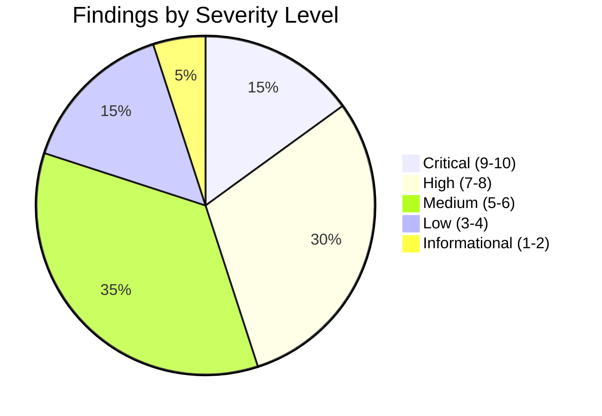
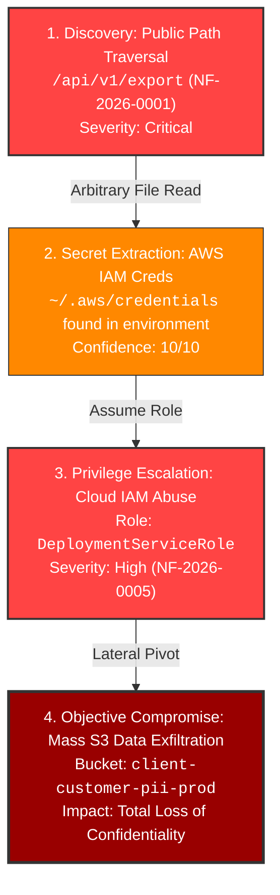

# Penetration Testing & Security Assessment Master Report

> **Schema Contract:** [`schemas/finding.md`](../schemas/finding.md)  
> **Composition Layer:** Integrates atomic findings rendered per [`templates/finding_template.md`](finding_template.md).  
> **Security Pack:** NIGHTFANG  
> **Host Runtime:** Hermes  

---

## 1. Document Control

| Property | Value |
| :--- | :--- |
| **Engagement Name** | `[ENGAGEMENT_NAME]` |
| **Engagement ID** | `[ENG-YYYY-NNNN]` |
| **Target Organization** | `[CLIENT_NAME]` |
| **Assessment Window** | `[START_DATE]` to `[END_DATE]` |
| **Document Version** | `1.0.0 (Final)` |
| **Lead Operator** | `[OPERATOR_HANDLE]` (Host Runtime: Hermes) |
| **Orchestration Layer** | NIGHTFANG Security Capability Pack |
| **Classification** | **CONFIDENTIAL / RESTRICTED** |
| **Authorized Distribution** | `[Client Security Team, CISO, Lead Systems Architect]` |

---

## 2. Executive Summary

> **Audience**: Executive Leadership, Board of Directors, CISO, and Governance Stakeholders.  
> **Purpose**: High-level, business-impact-focused synthesis answering four fundamental questions: *What was assessed? What was found? What does it affect? What requires immediate leadership attention?*

### 2.1 Engagement Scope & Purpose
During the assessment window of **[START_DATE]** to **[END_DATE]**, authorized security testing was conducted against **[CLIENT_NAME]**'s declared digital footprint. Testing was executed by the NIGHTFANG security capability pack operating under strict scope governance, non-destructive safety constraints (SOP-05), and mandatory Human-in-the-Loop (HITL) authorization gates (SOP-04).

The primary objective was to identify security vulnerabilities, evaluate defense-in-depth controls, model adversarial kill chains, and provide actionable engineering remediation alongside production-ready detection rules.

### 2.2 Overall Security Posture
The overall security posture of the assessed environment is evaluated as **[CRITICAL / HIGH RISK / ELEVATED / MODERATE / ROBUST]**. 

Testing identified a total of **[TOTAL_COUNT]** vulnerabilities across external perimeters, web applications, internal APIs, and cloud services. Of these:
- **[CRITICAL_COUNT]** findings are rated **Critical Severity**, capable of facilitating unauthenticated Remote Code Execution, complete tenant compromise, or arbitrary database exfiltration.
- **[HIGH_COUNT]** findings represent **High Severity** risks, permitting privilege escalation, sensitive credential disclosure, or unauthorized administrative actions.
- **[KEV_COUNT]** vulnerabilities are actively exploited in the wild according to the **CISA Known Exploited Vulnerabilities (KEV)** catalog.
- **[AVG_GROUNDING]** average Evidence Grounding Index, reflecting that all critical and high findings were backed by raw, cryptographically verified proof artifacts without speculation.

### 2.3 Business Impact & Strategic Risk
If exploited by malicious actors, the identified weaknesses present substantial operational, legal, and reputational liabilities:
1. **Direct Data Breach Risk:** [Exfiltration of customer PII, confidential intellectual property, or financial transaction databases.]
2. **Operational Disruption:** [Ransomware deployment vectors, critical infrastructure outage, or cloud account hijacking.]
3. **Compliance & Regulatory Exposure:** [Non-compliance with GDPR Article 32, PCI-DSS v4.0 Requirement 6, HIPAA Security Rule, and SEC Cybersecurity Disclosure rules.]

### 2.4 Executive Action Plan
Leadership should immediately authorize the following tactical actions:
- **Phase 1 (Hours 0–48):** Apply emergency virtual patching and IP access restrictions for Findings `[NF-XXXX-001]` and `[NF-XXXX-002]`.
- **Phase 2 (Days 1–14):** Ingest and deploy the attached Microsoft Sentinel (KQL) and Splunk (SPL) detection rules into the corporate SIEM/SOC to alert on active exploit attempts.
- **Phase 3 (Days 15–45):** Refactor authentication and input validation routines according to the MITRE D3FEND countermeasures outlined in Section 12.

### 2.5 Executive Findings Distribution Matrix

```text
┌────────────────────────────────────────────────────────────────────────────────────────┐
│ MASTER FINDINGS SUMMARY BY SEVERITY & EXPLOITATION READINESS                          │
├───────────────────────┬─────────┬───────────────┬────────────────┬─────────────────────┤
│ Severity Classification│ Count   │ Confirmed PoC │ Exploited/Demo │ CISA KEV Catalog    │
├───────────────────────┼─────────┼───────────────┼────────────────┼─────────────────────┤
│ 🔴 Critical (9–10)     │ [N]     │ [N]           │ [N]            │ [N]                 │
│ 🟠 High (7–8)          │ [N]     │ [N]           │ [N]            │ [N]                 │
│ 🟡 Medium (5–6)        │ [N]     │ [N]           │ [N]            │ [N]                 │
│ 🟢 Low (3–4)           │ [N]     │ [N]           │ [N]            │ [N]                 │
│ ℹ️ Informational (1–2) │ [N]     │ [N]           │ [N]            │ [N]                 │
├───────────────────────┼─────────┼───────────────┼────────────────┼─────────────────────┤
│ TOTAL UNIQUE FINDINGS │ [TOTAL] │ [TOTAL_CONF]  │ [TOTAL_DEMO]   │ [TOTAL_KEV]         │
└───────────────────────┴─────────┴───────────────┴────────────────┴─────────────────────┘
```

---

## 3. Engagement Scope & Governance

### 3.1 Authorized Target Inventory
Testing was strictly confined to assets explicitly authorized by **[CLIENT_NAME]** under SOP-01:

| Target Asset | Asset Type | In-Scope Boundaries / Identifiers | Capability Route |
| :--- | :--- | :--- | :--- |
| `[primary-domain.com]` | Domain | Apex domain and all subdomains under `*.primary-domain.com` | `attack-surface-mapping` |
| `[198.51.100.0/24]` | Network CIDR | Dedicated production edge subnet | `network-infrastructure-security` |
| `[https://app.client.com]` | Web Application | Production SPA and API backend `/api/v1/*` | `web-application-security` |
| `[arn:aws:iam::123456789012]` | Cloud Tenant | Production AWS Organization & S3 Buckets | `cloud-security` |
| `[corp.client.internal]` | Active Directory | Corporate Forest & Kerberos Key Distribution Center | `active-directory-security` |

### 3.2 Out-of-Scope Assets & Third-Party Exclusions
All assets, cloud provider infrastructure, and third-party SaaS services outside explicit written boundaries were strictly excluded:
- Third-party SaaS payment gateways, identity providers (Okta, Azure AD external tenants), and CDN shared infrastructure.
- Denial of Service (DoS/DDoS) stress testing, network bandwidth saturation, and physical facility probing.
- All testing traffic directed at multi-tenant edge nodes was verified before tool execution via the Scope Gate.

### 3.3 Authorization Governance Log
- Written Authorization Received: `[YYYY-MM-DD]` from `[Sponsor Name, Title]`
- Emergency Engagement Kill-Switch: Verified active through `/stop` and SOP-07.
- Zero Out-of-Scope Traffic: Execution Policy Gateway logged 100% boundary compliance.

---

## 4. Methodology & Execution Policy Gateway

Testing was conducted using NIGHTFANG's structured 12-phase penetration testing lifecycle. All tool invocations were proxied through the **Execution Policy Gateway** (`integration/execution-policy-gateway.md`), ensuring fail-closed safety enforcement:

```text
Operator Request ──► Authorization Scope Gate ──► Capability Router ──► Workflow & Agent
                                                                               │
                                                                               ▼
Tool Execution ◄── [Approved] ◄── Execution Policy Gateway ◄── Skill Procedure
      │                                ├── Stage 1: Scope & OPSEC Noise Check
      ▼                                ├── Stage 2: Emergency Stop & Concurrency Lock
Tool Result                            ├── Stage 3: Rate Limiting & Backoff Throttle
      │                                ├── Stage 4: 5-D HITL Approval Token Gate (/go)
      ▼                                ├── Stage 5: Benign PoC Filter & Canary Registry
Validation Gate                        └── Stage 6: Verbatim Capture & SHA-256 Digest
      │
      ▼
Finding Schema ──► Reporter Agent ──► Executive & Technical Deliverable
```

### Gateway Controls Enforced:
1. **OPSEC Noise Profiles:** Every tool request declared its noise level (`QUIET`, `MODERATE`, `LOUD`). Prohibited unannounced loud network flooding.
2. **Adaptive Rate Limiting & Backoff:** Baseline rate enforced at operator limit (`[X] req/sec`). Target HTTP 429/503 responses triggered immediate 30-second backoff and rate halving per SOP-02.
3. **5-Dimensional HITL Exploitation Gate:** Active probes and exploit proofs were paused until the operator verified the exact 5-dimensional token (`engagement_id`, `operator_id`, `finding_id`, `technique`, `expiration`) via `/go [ID]`.
4. **Benign PoC Primitives:** Prohibited destructive commands (`rm -rf`, `DROP TABLE`, `mkfs`, backdoors). Only benign discovery commands (`id`, `whoami`, `SELECT version()`) were executed.
5. **100% Artifact Canary Tracking:** Every temporary uploaded file or database record was tracked in `engagement.cleanup_inventory[]` and verified deleted before phase completion.

---

## 5. Assessment Timeline & Execution Audit Log

| Timestamp (UTC) | Phase | Agent / Component | Event Description | Gateway Disposition |
| :--- | :--- | :--- | :--- | :--- |
| `[YYYY-MM-DD 09:00]` | Phase 1 | `recon` | Scope boundary initialized; passive DNS enumeration begun | `APPROVED (QUIET)` |
| `[YYYY-MM-DD 11:30]` | Phase 3 | `scanner` | Web endpoint discovery and parameter crawling | `RATE_THROTTLED (20 rps)` |
| `[YYYY-MM-DD 14:15]` | Phase 4 | Gateway | HTTP 429 received from `api.target.com`; 30s auto-backoff applied | `BACKOFF_TRIGGERED` |
| `[YYYY-MM-DD 16:40]` | Phase 7 | `scanner` | Candidate SQL injection detected; emitted HITL approval request | `HITL_PAUSE` |
| `[YYYY-MM-DD 16:42]` | Phase 7 | Operator | Operator issued `/go NF-2026-0001`; 5-D token validated | `TOKEN_VERIFIED` |
| `[YYYY-MM-DD 16:45]` | Phase 8 | `validation` | Benign `version()` extraction verified; SHA-256 hashed | `VERDICT: PASS` |
| `[YYYY-MM-DD 18:00]` | Phase 10| `reporter` | Deliverable compiled adhering to finding schema | `COMPLETED` |

---

## 6. Attack Surface & Target Profiling

### 6.1 Discovered Perimeter & Host Topology
- **Total Apex Domains Profiled:** `[N]`
- **Active Subdomains Identified:** `[N]` (via certificate transparency, passive DNS, and brute enumeration)
- **Routable IP Addresses Exposed:** `[N]` IPv4 addresses across `[N]` CIDR allocations.
- **Open Port / Network Service Footprint:**
  - Port 80/443 (HTTP/HTTPS): `[N]` endpoints
  - Port 22 (SSH): `[N]` endpoints
  - Port 445/139 (SMB): `[N]` endpoints (Internal / VPN)
  - Port 3389 (RDP): `[N]` endpoints

### 6.2 Technology Stack & Component Inventory
- **Web Technologies:** `[e.g., React SPA, Next.js, Nginx, Apache Tomcat, Node.js Express]`
- **API Formats:** `[REST JSON, GraphQL (/graphql), gRPC, OpenAPI 3.0]`
- **Cloud Infrastructure:** `[Amazon Web Services (us-east-1, eu-west-1), Cloudflare CDN]`
- **Identity & Directory:** `[Microsoft Active Directory Forest, Okta SAML Federation]`

---

## 7. Master Findings Matrix & Lifecycle Tracker

Every finding is tracked through NIGHTFANG's complete 8-stage lifecycle:
`[1] DISCOVERED ──► [2] CANDIDATE ──► [3] DUAL-VERIFIED ──► [4] HITL APPROVED ──► [5] VALIDATED ──► [6] REPORTED ──► [7] REMEDIATED ──► [8] RETESTED`

| # | Finding ID | Finding Title | Target Asset | Severity | Confidence | Grounding | CVSS v4.0 | EPSS | KEV | Lifecycle State | Validation Verdict |
|---|------------|---------------|--------------|----------|------------|-----------|-----------|------|-----|-----------------|--------------------|
| 1 | `NF-2026-0001` | [Finding Title 1] | `[Endpoint 1]` | **10** (Crit) | **8** (Conf) | **0.95** (Certain) | 9.8 | 0.94 | Yes | `REPORTED` | `PASS` (Q1-Q7) |
| 2 | `NF-2026-0002` | [Finding Title 2] | `[Endpoint 2]` | **8** (High) | **8** (Conf) | **0.85** (Strong) | 8.2 | 0.42 | No | `REPORTED` | `PASS` (Q1-Q7) |
| 3 | `NF-2026-0003` | [Finding Title 3] | `[Endpoint 3]` | **6** (Med)  | **6** (Likely)| **0.75** (Probable)| 5.4 | 0.08 | No | `CANDIDATE`| `DOWNGRADE (Q5)` |
| 4 | `NF-2026-0004` | [Finding Title 4] | `[Endpoint 4]` | **4** (Low)  | **7** (Conf) | **0.85** (Strong) | 3.1 | 0.01 | No | `REPORTED` | `PASS` (Q1-Q7) |

---

## 8. Risk Distribution & Analytics


```mermaid
pie title Findings by Severity Level
    "Critical (9-10)" : 15
    "High (7-8)" : 30
    "Medium (5-6)" : 35
    "Low (3-4)" : 15
    "Informational (1-2)" : 5
```

### 8.1 Evidentiary Grounding Distribution
- **0.95 (CERTAIN):** `[N]` findings (`[XX]%`) — Full unedited raw request/response proof with SHA-256 match.
- **0.85 (STRONG):** `[N]` findings (`[XX]%`) — High-fidelity execution log confirming sink interaction.
- **0.75 (PROBABLE):** `[N]` findings (`[XX]%`) — Consistent behavioral anomaly / timing verification.
- **0.65 (TENTATIVE):** `[N]` findings (`[XX]%`) — Blind differential responses without direct sink exfiltration.
- **0.55 (WEAK):** `[N]` findings (`[XX]%`) — Version banner / passive heuristic indicators.

### 8.2 Threat Prioritization (EPSS vs. CVSS Matrix)
Vulnerabilities exhibiting both high CVSS base impact and high EPSS probability represent immediate real-world threats requiring emergency remediation:
- **Quadrant 1 (Critical Impact + High Exploitability):** `[Findings NF-YYYY-001, ...]`
- **Quadrant 2 (High Impact + Low Exploitability):** `[Findings NF-YYYY-002, ...]`

---

## 9. Attack Chains & Composite Scenarios

Adversaries do not exploit vulnerabilities in isolation; they chain disparate weaknesses across network and application tiers to achieve lateral movement and privilege escalation.

### Attack Chain 1: [Unauthenticated Perimeter Breach to Cloud Environment Takeover]


```mermaid
graph TD
    A["1. Discovery: Public Path Traversal<br/><code>/api/v1/export</code> (NF-2026-0001)<br/>Severity: Critical"] -->|Arbitrary File Read| B["2. Secret Extraction: AWS IAM Creds<br/><code>~/.aws/credentials</code> found in environment<br/>Confidence: 10/10"]
    B -->|Assume Role| C["3. Privilege Escalation: Cloud IAM Abuse<br/>Role: <code>DeploymentServiceRole</code><br/>Severity: High (NF-2026-0005)"]
    C -->|Lateral Pivot| D["4. Objective Compromise: Mass S3 Data Exfiltration<br/>Bucket: <code>client-customer-pii-prod</code><br/>Impact: Total Loss of Confidentiality"]
    
    style A fill:#ff4444,stroke:#333,stroke-width:2px,color:#fff
    style B fill:#ff8800,stroke:#333,stroke-width:1px,color:#fff
    style C fill:#ff4444,stroke:#333,stroke-width:2px,color:#fff
    style D fill:#990000,stroke:#333,stroke-width:3px,color:#fff
```

**Narrative Analysis:**  
An unauthenticated external attacker sends a traversal payload to the export API endpoint, successfully reading local configuration files. Among the extracted data are static AWS service credentials. The attacker assumes the associated IAM role, discovers excessive wildcard permissions (`s3:*`), and accesses sensitive customer PII buckets without triggering endpoint security alerts.

---

## 10. Detailed Technical Findings & Walkthroughs

> **Composition Architecture**: Each finding below is an autonomous technical deliverable rendered directly from [`schemas/finding.md`](../schemas/finding.md) using [`templates/finding_template.md`](finding_template.md). Raw evidence is presented verbatim with cryptographic hashes.

*(The reporting agent embeds one complete instance of `finding_template.md` for each finding in the Master Findings Table)*

---

### Finding NF-[YYYY]-[0001]: [Finding Title 1]
*(Render full `finding_template.md` instance here)*

---

### Finding NF-[YYYY]-[0002]: [Finding Title 2]
*(Render full `finding_template.md` instance here)*

---

## 11. Detection Engineering & Defensive Coverage

Every validated finding discovered during the engagement is paired with defensive detection engineering authored by the `detection-engineer` agent:

### 11.1 DeTT&CT Detection Maturity Matrix

| ATT&CK Technique | Technique Name | Finding ID | Detection Status | Rule Type | Primary Log Source |
| :--- | :--- | :--- | :--- | :--- | :--- |
| **T1190** | Exploit Public-Facing Application | `NF-2026-0001` | Prevention | Sigma / KQL | Web Server Access Logs |
| **T1059.004**| Unix Shell Execution | `NF-2026-0001` | Detection | Splunk SPL | Linux Auditd / Sysmon |
| **T1558.003**| Kerberoasting | `NF-2026-0008` | Detection | Sentinel KQL | Windows Event ID 4769 |
| **T1552.001**| Credentials In Files | `NF-2026-0002` | Telemetry | Elastic EQL | Endpoint File Integrity Monitor |

### 11.2 Detection Rule Catalog
*(Refer to individual finding walkthroughs in Section 10 for complete, machine-readable Sigma YAML, Sentinel KQL, and Splunk SPL queries ready for production SIEM deployment).*

---

## 12. Prioritized Remediation Roadmap & SLAs

Remediation is structured into four actionable priority tiers based on demonstrated impact, CVSS score, EPSS probability, and CISA KEV status:

### Tier 1: Emergency Remediations (Fix SLA: 24–48 Hours)
*Mandatory for Critical severity findings, active CISA KEV vectors, and exploitable RCE.*
- [ ] **Remediation 1.1:** [Action description, e.g., Implement canonical path allowlisting on `/api/v1/export`]
  - *Applicable Finding:* `NF-2026-0001`
  - *MITRE D3FEND Countermeasure:* `D3-UVI` (User Input Validation), `D3-FP` (File Path Restriction)
  - *Owner:* Backend Core Team

### Tier 2: High Priority Hardening (Fix SLA: 7–14 Days)
*Mandatory for High severity findings, privilege escalation vectors, and unauthenticated data leaks.*
- [ ] **Remediation 2.1:** [Action description, e.g., Revoke over-permissive IAM policies and enforce IMDSv2 session tokens]
  - *Applicable Finding:* `NF-2026-0002`
  - *MITRE D3FEND Countermeasure:* `D3-ARA` (Application Root Authentication)
  - *Owner:* Cloud Infrastructure & DevOps Team

### Tier 3: Medium Priority Hygiene (Fix SLA: 30–60 Days)
*Mandatory for Medium severity findings, defense-in-depth gaps, and missing rate controls.*
- [ ] **Remediation 3.1:** [Action description, e.g., Implement rate limiting and anti-CSRF token validation]
  - *Applicable Finding:* `NF-2026-0003`
  - *MITRE D3FEND Countermeasure:* `D3-WAF` (Web Application Firewall Filtering)
  - *Owner:* Application Engineering Team

### Tier 4: Strategic & Governance Improvements (Fix SLA: 90 Days)
- [ ] **Remediation 4.1:** Establish automated Software Bill of Materials (SBOM) scanning in CI/CD pipeline.
- [ ] **Remediation 4.2:** Conduct organization-wide Active Directory Certificate Services (ADCS) template audit.

---

## 13. Retest & Validation Status

NIGHTFANG requires closed-loop verification of all remediated endpoints through the [`fix-verifier`](../agents/fix-verifier.md) agent:

### 13.1 Canary Cleanup Ledger (SOP-05 Compliance)
Every temporary test canary deployed during proof-of-concept testing must be verified clean:

| Canary ID | Target Path / Host | Type | Deployed Timestamp | Removal Verified | Status |
| :--- | :--- | :--- | :--- | :--- | :--- |
| `canary_0042.txt` | `https://target-app.internal/tmp/` | File Upload | `2026-09-27T16:45:00Z` | `2026-09-27T16:50:00Z` | **CLEAN (HTTP 404)** |
| `canary_user_99` | `corp.client.internal` | AD Test Account | `2026-09-27T17:10:00Z` | `2026-09-27T17:30:00Z` | **DELETED** |

### 13.2 Post-Remediation Retest Register

| Finding ID | Remediation Date | Retest Date | Retest Agent | Non-Destructive PoC Retest Result | Status |
| :--- | :--- | :--- | :--- | :--- | :--- |
| `NF-2026-0001` | `[YYYY-MM-DD]` | `[YYYY-MM-DD]` | `fix-verifier` | Traversal sequence blocked (HTTP 400 Bad Request) | **RESOLVED** |
| `NF-2026-0002` | `[YYYY-MM-DD]` | `[YYYY-MM-DD]` | `fix-verifier` | Alternative bypass identified via double URL encoding | **REOPENED** |

---

## 14. Appendix: External Tool Inventory & Configurations

All tool invocations executed during the engagement were executed strictly through the Execution Policy Gateway with safe rate throttling:

| Tool Name | Version | Execution Mode | Safe Rate Enforced | Purpose |
| :--- | :--- | :--- | :--- | :--- |
| **`nmap`** | 7.95 | Gateway Subprocess | `--max-rate 20` | Port discovery & banner grab |
| **`ffuf`** | 2.1.0 | Gateway Subprocess | `-rate 20` | Directory and parameter fuzzing |
| **`nuclei`** | 3.2.0 | Gateway Subprocess | `-rate-limit 20` | Template-based vulnerability verification |
| **`curl`** | 8.6.0 | Gateway Subprocess | Token-Bucket Throttle | Deterministic HTTP reproduction & canary validation |
| **`Certipy`** | 4.8.2 | Gateway Subprocess | Single Query | Active Directory Certificate Services enumeration |

---

## 15. Evidence Index & Hash Manifest

> **Chain of Custody Guarantee**: Standard streams and HTTP transactions captured verbatim by the Execution Policy Gateway. Below is the immutable cryptographic ledger verifying proof artifact integrity:

| Evidence ID | Finding ID | Source Agent / Tool | Target Endpoint | Capture Timestamp | SHA-256 Digest | Status |
| :--- | :--- | :--- | :--- | :--- | :--- | :--- |
| `EVD-0001` | `NF-2026-0001` | `scanner` / `curl` | `https://target.internal/api/v1/export` | `2026-09-27T16:45:12Z` | `e3b0c44298fc1c149afbf4c8996fb92427ae41e4649b934ca495991b7852b855` | **VERIFIED** |
| `EVD-0002` | `NF-2026-0001` | `validation` / `curl`| `https://target.internal/api/v1/export` | `2026-09-27T16:48:30Z` | `4b227777d4dd1fc61c6f884f48641d02b4d121d3fd328cb08b5531fcacdabf8a` | **VERIFIED** |
| `EVD-0003` | `NF-2026-0002` | `cloud-sec` / `aws` | `arn:aws:iam::123456789012` | `2026-09-27T17:15:00Z` | `ef2d127de37b942baad06145e54b0c619a1f22327b2ebbcfbec78f5564afe39d` | **VERIFIED** |

---

## 16. Regulatory & Framework Cross-Reference

Every discovered finding is mapped across prominent international cybersecurity regulatory standards to assist audit and compliance teams:

| Finding ID | NIST CSF 2.0 | ISO/IEC 27001:2022 | SOC 2 Type II (TSC) | CIS Controls v8 | PCI-DSS v4.0 |
| :--- | :--- | :--- | :--- | :--- | :--- |
| **NF-2026-0001** | `PR.DS-01`, `PR.PS-01` | `A.8.24`, `A.8.28` | `CC6.1`, `CC6.6` | Control 16.4 | Req 6.2.4, Req 6.3.1 |
| **NF-2026-0002** | `PR.AC-01`, `PR.AC-04` | `A.5.15`, `A.9.2`  | `CC6.1`, `CC6.3` | Control 5.2 | Req 7.2.1, Req 7.2.2 |
| **NF-2026-0003** | `PR.DS-02`, `PR.IP-01` | `A.8.15`, `A.8.20` | `CC6.6`, `CC6.7` | Control 9.2  | Req 6.4.1, Req 6.4.2 |
| **NF-2026-0004** | `PR.IP-03`, `DE.CM-01` | `A.8.8`, `A.8.9`   | `CC6.8`, `CC7.2` | Control 7.1  | Req 2.2.4, Req 2.2.5 |

---

*End of Deliverable — NIGHTFANG Security Capability Pack (Hermes Agent Runtime)*
