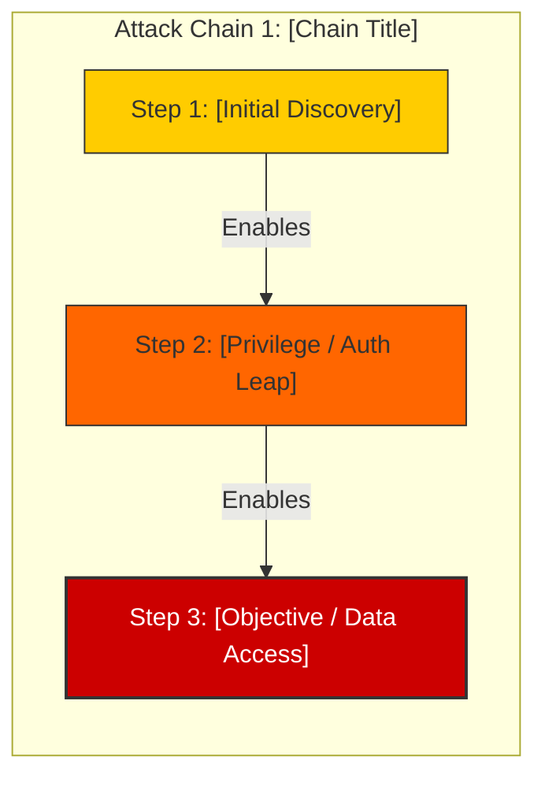

# Penetration Testing Assessment Report

**Engagement:** [ENGAGEMENT_NAME]  
**Target Organization:** [CLIENT_NAME]  
**Assessment Window:** [START_DATE] – [END_DATE]  
**Security Capability Pack:** NIGHTFANG  
**Host Runtime:** Hermes  
**Operator:** [OPERATOR_HANDLE]  

---

## 1. Executive Summary

### 1.1 Engagement Purpose
[Brief summary of engagement goals, authorization, target scope, and primary testing objectives.]

### 1.2 Overall Security Posture
[High-level summary of findings, overall risk score, and primary areas of concern.]

### 1.3 Findings Overview by Severity
```
┌────────────────────────────────────────────────────────┐
│ TOTAL FINDINGS DISCOVERED: [TOTAL]                     │
├─────────────────┬──────────┬──────────────┬────────────┤
│ Severity Level  │ Count    │ Confirmed    │ Exploited  │
├─────────────────┼──────────┼──────────────┼────────────┤
│ 🔴 Critical (9-10)│ [N]      │ [N]          │ [N]        │
│ 🟠 High (7-8)     │ [N]      │ [N]          │ [N]        │
│ 🟡 Medium (5-6)   │ [N]      │ [N]          │ [N]        │
│ 🟢 Low (3-4)      │ [N]      │ [N]          │ [N]        │
│ ℹ️ Informational  │ [N]      │ [N]          │ [N]        │
└─────────────────┴──────────┴──────────────┴────────────┘
```

### 1.4 Top Critical Findings
1. **[Finding Title 1]** — Severity: `[X]/10`, Confidence: `[Y]/10` (CVSS: `[Z]`)
2. **[Finding Title 2]** — Severity: `[X]/10`, Confidence: `[Y]/10` (CVSS: `[Z]`)
3. **[Finding Title 3]** — Severity: `[X]/10`, Confidence: `[Y]/10` (CVSS: `[Z]`)

---

## 2. Scope & Methodology

### 2.1 Authorized Scope
- **Domains & Hostnames:** `[DOMAINS]`
- **IP Ranges / Subnets:** `[IP_RANGES]`
- **Web & API Endpoints:** `[URLS]`
- **Authorized Ports & Services:** `[PORTS]`

### 2.2 Exclusions & Boundaries
- `[EXCLUDED_ASSETS]`
- Testing constraints: [No Denial of Service, zero data destruction, mandatory HITL approval for validation]

### 2.3 Assessment Methodology
The engagement followed the NIGHTFANG 10-Phase Workflow (`workflows/standard-pentest.md`):
1. **Intake & Scope Governance**
2. **Passive Reconnaissance** (OSINT, DNS, Cert Transparency)
3. **Active Reconnaissance** (Port scanning, service fingerprinting)
4. **Vulnerability Scanning & Enumeration** (OWASP Web, API, Network, AI)
5. **Attack Chain Formulation & Prioritization**
6. **Preliminary Reporting & Candidate Selection**
7. **Human-in-the-Loop Exploitation Approval Gate**
8. **Controlled Proof-of-Concept Validation**
9. **Impact Assessment & Testing Artifact Cleanup**
10. **Remediation & Final Deliverable Compilation**

---

## 3. Attack Chain Visualizations


```mermaid
graph LR
    subgraph "Attack Chain 1: [Chain Title]"
        A["Step 1: [Initial Discovery]"] -->|Enables| B["Step 2: [Privilege / Auth Leap]"]
        B -->|Enables| C["Step 3: [Objective / Data Access]"]
    end
    style A fill:#ffcc00,stroke:#333,stroke-width:1px
    style B fill:#ff6600,stroke:#333,stroke-width:1px
    style C fill:#cc0000,stroke:#333,stroke-width:2px,color:#fff
```

---

## 4. Master Findings Table

| # | Finding ID | Title | Target Asset | Confidence | Severity | CVSS v3.1 | Status |
|---|------------|-------|--------------|------------|----------|-----------|--------|
| 1 | NF-2026-001 | [Title] | `[Endpoint]` | [X]/10 | [Y]/10 | 9.8 | Confirmed |
| 2 | NF-2026-002 | [Title] | `[Endpoint]` | [X]/10 | [Y]/10 | 7.5 | Demonstrated |

---

## 5. Detailed Technical Findings & Walkthroughs

[INCLUDE_INDIVIDUAL_FINDING_SECTIONS_PER_FINDING_TEMPLATE]

---

## 6. Prioritized Remediation Roadmap

### Immediate Actions (Within 24–48 Hours — Critical)
- [ ] **[Action 1]**: [Mitigation steps + D3FEND mapping]
- [ ] **[Action 2]**: [Mitigation steps + D3FEND mapping]

### Short-Term Fixes (Within 1–2 Weeks — High)
- [ ] **[Action 3]**: [Mitigation steps + D3FEND mapping]

### Medium-Term Hardening (Within 30–60 Days — Medium/Low)
- [ ] **[Action 4]**: [Architecture / process improvement]

### Verification Checklist
- [ ] Re-run non-destructive PoC commands
- [ ] Validate HTTP response codes and behavior
