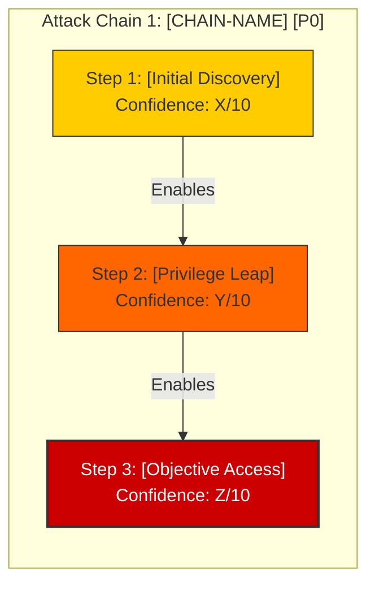

# 🦅 Penetration Testing Assessment Report
**Engagement:** [ENGAGEMENT_NAME]
**Target Organization:** [CLIENT_NAME]
**Assessment Window:** [START_DATE] – [END_DATE]
**Orchestrator:** NIGHTFANG Framework
**Operator:** [OPERATOR_HANDLE]
**Classification:** CONFIDENTIAL — [CLIENT_NAME] Eyes Only

---

## 1. Executive Summary

### 1.1 Engagement Purpose
[Brief summary of engagement goals, authorization, and scope parameters. One paragraph.]

### 1.2 Overall Security Posture
[High-level summary: "The target environment exhibits [strong/moderate/weak] security posture. Primary risks include [top 3 themes]. [Number] critical findings require immediate attention."]

### 1.3 Findings Overview by Severity
```
┌────────────────────────────────────────────────────────┐
│ TOTAL FINDINGS DISCOVERED: [TOTAL]                     │
├─────────────────┬──────────┬──────────────┬────────────┤
│ Severity Level  │ Count    │ Confirmed    │ Exploited  │
├─────────────────┼──────────┼──────────────┼────────────┤
│ 🔴 Critical (9-10)│ [N]      │ [N]          │ [N]        │
│ 🟠 High (7-8)     │ [N]      │ [N]          │ [N]        │
│ 🟡 Medium (5-6)   │ [N]      │ [N]          │ [N]        │
│ 🟢 Low (3-4)      │ [N]      │ [N]          │ [N]        │
│ ℹ️ Informational  │ [N]      │ [N]          │ [N]        │
└─────────────────┴──────────┴──────────────┴────────────┘
```

### 1.4 Top Critical Findings (Action Required Within 24-48 Hours)
1. **[Finding Title 1]** — Severity: `[X]/10`, Confidence: `[Y]/10` — [One-line impact]
2. **[Finding Title 2]** — Severity: `[X]/10`, Confidence: `[Y]/10` — [One-line impact]
3. **[Finding Title 3]** — Severity: `[X]/10`, Confidence: `[Y]/10` — [One-line impact]

### 1.5 Attack Chain Summary
[Number] attack chains identified. Highest priority: **[CHAIN-NAME]** (Priority: P0/P1) leading to [ultimate impact].

---

## 2. Scope & Methodology

### 2.1 Authorized Scope
- **Domains & Hostnames:** `[DOMAINS]`
- **IP Ranges / Subnets:** `[IP_RANGES]`
- **Web & API Endpoints:** `[URLS]`
- **Authorized Ports:** `[PORTS]`
- **AI/LLM Endpoints:** `[AI_ENDPOINTS]`

### 2.2 Exclusions & Boundaries
- `[EXCLUDED_ASSETS]`
- Testing constraints: [No DoS, no data destruction, HITL approval required for exploitation]

### 2.3 Assessment Methodology
The engagement followed the **NIGHTFANG 6-Phase Enhanced Methodology**:

1. **Passive Reconnaissance** — OSINT, DNS, Cert Transparency, GitHub dorks, learned evasion profiles
2. **Active Reconnaissance** — Calibrated port scanning (T4), service detection, OS fingerprinting, evasion-enabled
3. **Vulnerability Scanning** — Parallel multi-domain scanning with custom templates & operator-calibrated tools
4. **Threat Hunting & Attack Chains** — Logic flaws, chain building with NIGHTFANG templates, creative testing
5. **Human-in-the-Loop Exploitation** — Benign POC only, mandatory cleanup verification, per-finding `/go`
6. **Remediation & Deliverables** — Executive-ready reports, code-level fixes, ticket creation

### 2.4 Tool Calibration (NIGHTFANG)
| Tool | Calibration | Effectiveness |
|------|-------------|---------------|
| nmap | T4, --min-rate 2000 | 94% |
| ffuf | 150 req/s, custom wordlists | 89% |
| nuclei | Custom templates, concurrency 25 | 76% |
| sqlmap | Risk 2, Level 3, batch | 82% |

---

## 3. Attack Chain Visualizations



---

## 4. Master Findings Table

| # | ID | Title | Target Asset | Confidence | Severity | Status | Chain |
|---|----|-------|--------------|------------|----------|--------|-------|
| 1 | NIGHTFANG-001 | [Title] | `[Endpoint]` | [X]/10 | [Y]/10 | `[Status]` | CHAIN-XXX |
| 2 | NIGHTFANG-002 | [Title] | `[Endpoint]` | [X]/10 | [Y]/10 | `[Status]` | — |

---

## 5. Detailed Technical Findings & Walkthroughs

[INCLUDE_INDIVIDUAL_FINDING_SECTIONS_HERE — Using templates/personal_finding_template.md]

---

## 6. Prioritized Remediation Roadmap

### 🔴 Immediate Actions (Within 24-48 Hours)
- [ ] **[Critical Fix 1]** — [Specific code/config change] — Owner: [Team] — SLA: 48h
- [ ] **[Critical Fix 2]** — [Specific code/config change] — Owner: [Team] — SLA: 48h

### 🟠 Short-Term Fixes (Within 1-2 Weeks)
- [ ] **[High Fix 1]** — [Specific code/config change] — Owner: [Team] — SLA: 1 week
- [ ] **[High Fix 2]** — [Specific code/config change] — Owner: [Team] — SLA: 1 week

### 🟡 Medium-Term Improvements (Within 30 Days)
- [ ] **[Medium Fix 1]** — [Architecture/process improvement] — Owner: [Team] — SLA: 30 days

### 🟢 Strategic Improvements (Within 90 Days)
- [ ] **[Architecture Fix 1]** — [Long-term architectural change] — Owner: [Team] — SLA: 90 days
- [ ] **[Policy/SAST Fix]** — [Process/tooling improvement] — Owner: [Team] — SLA: 90 days

---

## 7. Engagement Audit Trail & Evidence Log

| Metric | Value |
|--------|-------|
| Total Requests Sent | `[N]` |
| Total Swarm Agents Deployed | `[N]` |
| NIGHTFANG Personal Agents | `[N]` |
| Operator `/go` Authorizations | `[N]` |
| Findings Exploited (Confidence 10) | `[N]` |
| Attack Chains Formed | `[N]` |
| Custom Templates Applied | `[N]` |
| Artifacts Cleaned Up | `[All verified deleted with screenshots]` |
| Evidence Files (SHA-256) | `[Count]` |
| Report Generation Time | `[Timestamp]` |

---

## 8. Appendix: Framework Mappings Summary

### MITRE ATT&CK Techniques Observed
| Technique ID | Name | Findings |
|--------------|------|----------|
| T1190 | Exploit Public-Facing Application | [Count] |
| T1552.004 | Private Keys | [Count] |
| ... | ... | ... |

### MITRE D3FEND Countermeasures Recommended
| D3FEND ID | Name | Applied To |
|-----------|------|------------|
| D3-PSA | Parameter Sanitization Analysis | [Finding IDs] |
| D3-KDU | Key Diversion | [Finding IDs] |
| ... | ... | ... |

---

*Report generated by NIGHTFANG on [TIMESTAMP UTC]*
*All findings verified with 100% reproducible steps*
*Evidence integrity verified via SHA-256 hashes*