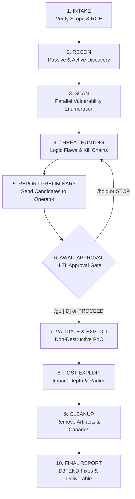

# Standard Penetration Testing Workflow

**Workflow ID**: `standard-pentest`  
**Description**: Comprehensive end-to-end blackbox and greybox penetration testing workflow spanning reconnaissance, vulnerability enumeration, threat hunting, HITL-approved exploit validation, and remediated reporting.  
**Required Agents**: `recon`, `scanner`, `ai-security`, `validation`, `reporter`  
**Finding Schema**: [`schemas/finding.md`](../schemas/finding.md)  
**Standard Operating Procedures**: [`references/sops.md`](../references/sops.md)  
**Triage & Heuristics**: [`references/heuristics.md`](../references/heuristics.md)  

---

## Workflow Overview

---

## Phases & Execution Logic

### Phase 1: Intake & Scope Governance
- **Actions**: Parse targets, CIDRs, domains, credentials, and testing windows.
- **SOP Compliance**: Enforce [SOP-01 (Scope Verification)](../references/sops.md#sop-01-scope-verification--boundary-enforcement).
- **Exit Criteria**: Scope explicitly confirmed; target ASNs and boundaries validated.

### Phase 2: Reconnaissance (`recon`)
- **Passive Discovery**: Query crt.sh, public DNS records, WHOIS, search engine dorks, and repository disclosures.
- **Active Discovery**: Port scanning (`nmap -sS -T4`), service version detection, WAF identification (`wafw00f`), and web technology fingerprinting.
- **Exit Criteria**: Attack surface mapped; live hosts and exposed endpoints cataloged.

### Phase 3: Parallel Vulnerability Scanning (`scanner`, `ai-security`)
- **Parallel Execution**: Web, API, network, and AI scanners execute concurrently across cataloged targets.
- **Deconfliction**: Enforce target port locking and path deduplication per [heuristics.md](../references/heuristics.md#4-swarm-deconfliction--resource-locking-heuristic).
- **Rate Limiting**: Enforce [SOP-02](../references/sops.md#sop-02-rate-limiting--stealth-management) (100 req/sec cap, 429 auto-backoff).
- **Standardized Findings**: All candidates recorded conforming to [`schemas/finding.md`](../schemas/finding.md).

### Phase 4: Threat Hunting & Attack Chain Correlation
- **Logic Flaw Hunting**: Test for multi-step workflow bypasses, race conditions (TOCTOU), and parameter pollution.
- **Chain Formulation**: Correlate isolated findings into compound kill chains using the priority formula:
  $$\text{Priority} = (\text{Max Severity} \times 0.6) + (\text{Min Confidence} \times 0.4) - (\text{Step Count} \times 0.2)$$
- **Exit Criteria**: Attack chains documented and prioritized.

### Phase 5: Preliminary Reporting & Candidate Selection
- Compile candidate findings where the proposed next action is active or invasive — these require HITL approval before proceeding.
- Severity score is included in operator alerts as urgency context; it does not determine whether HITL is triggered.
- Dispatch structured alerts through the host runtime operator interface.

### Phase 6: Human-in-the-Loop (HITL) Approval Gate
- **PAUSE EXECUTION**: Suspend automated exploitation until explicit operator confirmation is received.
- **Commands**:
  - `/go [ID]` or `PROCEED`: Authorizes validation for specific finding.
  - `/hold [ID]` or `STOP`: Holds or rejects exploitation; preserves finding at current confidence score.
- **Audit Logging**: Record operator approval tokens and timestamps.

### Phase 7: Controlled Proof-of-Concept Validation (`validation`)
- Execute benign, non-destructive proofs-of-concept only (e.g., `id`, `whoami`, `SELECT version()`).
- Upgrade finding Confidence score to `7–9` (Confirmed) or `10` (Demonstrated).
- Enforce strict safety constraints: zero DoS, zero persistent backdoors, zero data destruction.
- Capture raw request/response streams and compute SHA-256 evidence hashes per [SOP-06](../references/sops.md#sop-06-evidence-hashing--chain-of-custody).

### Phase 8: Post-Exploitation & Impact Radius Assessment (`validation`)
- Assess technical blast radius (privilege level, network segment reachability, access depth).
- Evaluate defense logging and detection telemetry.

### Phase 9: Testing Artifact & Canary Cleanup
- Enforce [SOP-05](../references/sops.md#sop-05-proof-of-concept-safety--artifact-cleanup).
- Immediately delete all dropped canary files, temporary users, and test objects.
- Verify target state returns to pre-test baseline (HTTP 404 verification).

### Phase 10: Final Deliverable Compilation (`reporter`)
- Compile full deliverables using [`templates/full_report_template.md`](../templates/full_report_template.md).
- Map every finding to MITRE ATT&CK / ATLAS, CVSS v3.1, and **MITRE D3FEND** countermeasures.
- Formulate tri-tier remediation roadmaps with SLAs (24-48h for Critical, 1 week for High).
